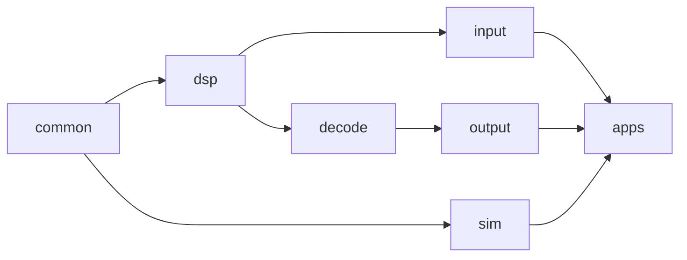
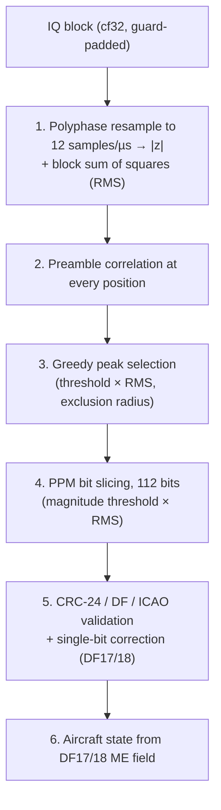
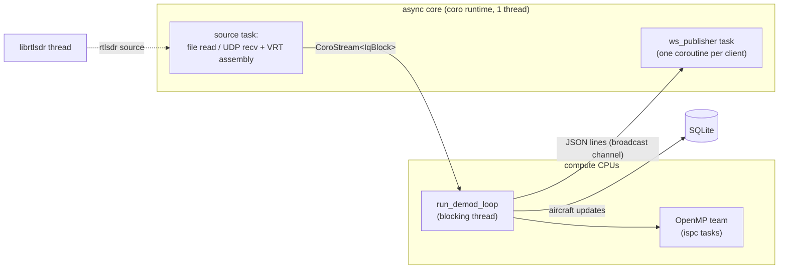

# adsb-demod

An ADS-B (1090 MHz Mode S) receiver: a C++ demodulator with an
[ispc](https://ispc.github.io/)-vectorized, multithreaded DSP core. It reads IQ
from a SigMF recording, a VITA-49 (VRT) UDP stream or a live RTL-SDR, and
decodes Mode S frames and aircraft state. Results go to stdout, a WebSocket
(for the Flutter UI in [ui/frontend](ui/frontend)) and an optional SQLite
history.

The Julia files at the top level ([adsb_detect.jl](adsb_detect.jl),
[polyphase.jl](polyphase.jl), [adsb.jl](adsb.jl),
[preamble_detect.jl](preamble_detect.jl)) are the reference prototype. The
C++ resampling filter follows the design in [polyphase.jl](polyphase.jl) (see
[Resampling filter](#resampling-filter)).

## Repository layout

```
adsb/
  *.jl                     Julia reference prototype
  conan-recipes/librtlsdr  local Conan recipe for librtlsdr
  ui/frontend/             Flutter UI (map, aircraft table, frame log, waterfall)
  proto/                   the C++ implementation
    CMakeLists.txt, conanfile.py
    src/
      common/   constants, cpu_layout (CPU split), tasksys.cpp (ispc task runtime on OpenMP)
      dsp/      demod, peak_select, filter_bank, spectrum, iq_block (block + stitcher), kernels.ispc
      decode/   frame_decode (CRC, DF, ICAO), aircraft (callsign/altitude/CPR position/velocity)
      input/    file_stream, vita49_stream + vrt_assembler, rtlsdr_stream, sigmf_meta
      output/   ws_publisher (WebSocket fan-out), aircraft_history (SQLite), frame_recorder (debug HDF5)
      sim/      adsb_sim (Mode S signal simulator), sim_kernels.ispc
      apps/
        adsb/           the receiver: main.cpp (CLI), pipeline.{h,cpp} (demod loop, per-frame handling)
        vita49_send/    VRT/UDP sender: RTL-SDR or simulated traffic
        adsb_sim_eval/  simulator -> demodulator detection statistics
    tests/      ctest tests, test captures (tests/data), vrt_to_sigmf.py
    filters/    optional filter coefficient files + export_filter.jl
    scenarios/  simulator scenarios (boston.json)
    doc/        design notes (vita49-format.md), known issues
    tools/      udp_sink.c (UDP receive diagnostics), debug_h5.jl (offline rerun of --debug-h5 frames)
    handoff/    benchmark/reference-output notes
```

Each `src/` directory builds as one static library. Headers sit next to their
sources and are included as `"dir/name.h"`. The dependency order is:



Each module's internals live in anonymous namespaces in its `.cpp` file. The
headers declare only what other translation units use.

## Build

Dependencies come from Conan: `coro`, `librtlsdr` (from
[conan-recipes/librtlsdr](conan-recipes/librtlsdr)), `argparse`,
`nlohmann_json`, `fftw` (float only), `sqlite3`, `xtensor` and `highfive`
(with `hdf5`). `coro` is
developed alongside this project and has to be exported to the local Conan
cache. You also need `ispc` on `PATH` (or set `ISPC_ROOT`), plus OpenMP.

```sh
cd proto
conan install . --build=missing
cmake --preset conan-release
cmake --build build/Release -j
ctest --test-dir build/Release
```

The executables (`adsb`, `vita49_send`, `adsb_sim_eval`) end up in
`build/Release/`.

CMake cache options:

| Option | Default | Meaning |
|---|---|---|
| `ADSB_SAMPLES_PER_SYMBOL` | 12 | Resampled rate in samples per 1 µs Mode S symbol. Compiled into the kernels. |
| `ADSB_ISPC_TARGET` | *(autodetect)* | ispc `--target` override, e.g. `avx2-i32x8`, to compare against AVX-512. |

## Running

`adsb` takes global options, then a source subcommand, then that source's
options:

```sh
build/Release/adsb [global options] {file|vita49|rtlsdr} [source options]
```

| Global option | Default | |
|---|---|---|
| `--filter-taps` | 32 | Taps per phase of the designed resampling filter |
| `--filter-phases` | 64 | Phases of the designed resampling filter |
| `--filter-cutoff` | 3e6 | Lowpass cutoff of the designed filter in Hz, clamped to the input and resampled Nyquist |
| `--filter-window` | hann | Window of the designed lowpass: `hann`, `hamming`, `blackman` or `kaiser` |
| `--filter-kaiser-beta` | 8 | Kaiser window beta, with `--filter-window kaiser` |
| `--filter-matched` | off | Also convolve the designed lowpass with a 0.5 µs boxcar (a filter matched to Mode S pulses) |
| `--filter`, `--filter-meta` | off | Load the filter bank from these files instead of designing it |
| `--rate` | from source | Input sample rate in Hz. `file` reads it from SigMF; `vita49` and `rtlsdr` use 2.4e6. For `vita49` it must match the sender's rate: an IF Context packet that advertises a different rate is a fatal error. |
| `--freq` | 1090e6 | Center frequency. It is the tuner frequency for `rtlsdr` and labels the spectrum frames. |
| `--preamble-min` | 3.0 | Preamble correlation threshold, in units of the block RMS |
| `--slice-mag-min` | 112 | Bit-slice magnitude threshold, in units of the block RMS |
| `--ws-port` | 0 (off) | Publish JSON over WebSocket on this port |
| `--history-db` | off | SQLite file recording every aircraft update, for the UI's time scrubber |
| `--spectrum` | off | Publish a 1024-point FFT of the raw IQ every 150 ms (for the waterfall) |
| `--no-stdout` | | Don't print frames to stdout |
| `--debug-h5` | off | Write every decoded frame, with its IQ and everything needed to rerun the demodulator, to this HDF5 file (see [Debug HDF5](#debug-hdf5)) |
| `--debug-h5-failed-only` | | With `--debug-h5`, record only frames that fail CRC (not unchecked ones) |

Sources:

- **`file --iq x.sigmf-data [--meta x.sigmf-meta]`**: replays an interleaved
  cf32 SigMF recording.
- **`vita49 --port P [--bind addr] [--stream-id N] [--idle-timeout s]`**:
  receives VRT IF Data packets (big-endian int16 IQ) plus IF Context packets
  (rate, RF frequency) over UDP. The format is described in
  [proto/doc/design/vita49-format.md](proto/doc/design/vita49-format.md).
- **`rtlsdr [--device N] [--gain dB] [--buf-num N] [--buf-len B]`**: reads
  from a live dongle. A negative gain means auto gain.

Other tools:

- **`vita49_send --dest-port P [--rate] [--freq] ... {rtlsdr|sim}`**: streams
  VRT/UDP. The `sim` source renders simulated traffic from a scenario
  (`--scenario scenarios/boston.json`, `--snr-db`, `--duration`, `--seed`,
  and pulse shape and receiver filter options). The simulator encodes DF17
  identification, airborne position and velocity messages plus DF11 squitters.
  Pulses are on-off keyed with finite edges and jitter, followed by an
  anti-alias filter and AWGN. The output is deterministic for a given seed.
- **`adsb_sim_eval --scenario ... [--snr-db] [--duration] [--rate]`**:
  feeds the simulator straight into `AdsbDemod`, block by block, through the
  same `BlockStitcher` path as `adsb` (`--block` sets the block size). It then
  matches the output against the simulator's ground truth and reports, per
  category (all, block-cut, overlapping, clean, per DF, per aircraft), the
  rates for preamble detected, frame output, raw CRC OK, CRC fixed, CRC OK and
  exact match. It also breaks down the misses, false candidates and
  candidate timing error.
- **`tests/vrt_to_sigmf.py`**: records a VRT stream to a SigMF file pair.
- **`tools/udp_sink.c`**: a receive-only UDP sink that reports packet loss,
  gaps and kernel drops.

## Algorithm

Each input block (128k samples) goes through the stages below.
`AdsbDemod::exec` ([proto/src/dsp/demod.cpp](proto/src/dsp/demod.cpp)) runs
stages 1–4, and `compute_frame_view` and `update_aircraft_from_me` run the
decode stages.

Before a block is demodulated, its guard padding is filled with the
neighboring blocks' samples (see [Runtime and threading](#runtime-and-threading)).
Each block scans only the preamble positions centered on its own samples, and
reads into the trailing padding for the tap window and the rest of the frame.
A frame that straddles a boundary therefore decodes as if the stream were one
array.



1. **Resample and envelope** (`resample_block` in
   [kernels.ispc](proto/src/dsp/kernels.ispc)).
   - A polyphase FIR bank (`Np` phases × `taps`; the default is 64 × 32)
     resamples the complex input to `ADSB_SAMPLES_PER_SYMBOL` (12) samples
     per µs, and each output is the magnitude `|z|`.
   - Output `m` sits at input position `m·ry/rx + 1/2 + 1/(2Np)`. The
     position is computed in closed form in 36-bit fixed point, and its
     integer and fractional parts give the center sample and the filter
     phase. Outputs don't depend on each other, and no divide is needed.
     With an even tap count the window is centered half a sample later, so
     the `1/2` is dropped and outputs land at the same input times.
   - 32 taps fill each filter row exactly (64 floats); 33 would pad each
     row to 80.
   - The SIMD gang runs across taps for one output at a time. Every tap is
     stored twice (`h0,h0,h1,h1,…`), so each load of coefficients lines up
     with the interleaved I/Q input without shuffles. Each filter row is
     zero-padded to a multiple of 16.
   - Partial sums are combined with a transpose-and-sum across the batch of
     outputs.
   - The same pass also sums the squares of the raw input, which gives the
     block RMS.
   - The work is split into contiguous ranges, one per ispc task. The output
     count is rounded up to a multiple of 64, so every batch is full and the
     kernel has no bounds checks.
2. **Preamble correlation** (`preamble_scan`).
   - Every output position `k` gets the score
     `Σ y[k + j·6]·pat[j]` over the 16 half-µs chips of the fixed Mode S
     preamble `[1,-1,1,-1,-1,-1,-1,1,-1,1,-1,-1,-1,-1,-1,-1]`.
   - There is no sub-chip phase search. Peak selection handles alignment.
3. **Peak selection** (`select_preamble_peaks` in
   [peak_select.cpp](proto/src/dsp/peak_select.cpp)).
   - The candidates are the positions scoring at least
     `--preamble-min × RMS`.
   - Repeat until none are left: accept the highest remaining score, then
     discard everything within `(8 + 112) µs` of it on either side.
   - This rejects the correlation's own sidelobes and matches inside the
     message pulses, so the slicer starts on the true peak.
   - The last pick's exclusion zone carries over into the next block, if
     that block is contiguous. The selection is greedy per block, so a pick
     near the end of a block stays final even if a stronger peak follows just
     past the boundary. A sidelobe picked there fails CRC, and its zone then
     suppresses the true peak, losing the frame. This is rare (about 1e-4 per
     strong frame); see the note on `AdsbDemod` in
     [demod.h](proto/src/dsp/demod.h) for a fix.
4. **Bit slicing** (`slice_scan`).
   - For each accepted candidate, the slicer reads 112 bits starting 8 µs
     after the preamble. Bit `i` is `y[a] > y[a+6]`: early chip against
     late chip.
   - `Σ|y[a] − y[a+6]|` is the frame magnitude. Frames below
     `--slice-mag-min × RMS` are dropped. `confidence` is this magnitude
     divided by the RMS.
   - The thresholds are scaled by the RMS instead of normalizing `y`. This
     works because everything downstream is linear in the input scale.
5. **Validation** ([frame_decode.cpp](proto/src/decode/frame_decode.cpp)).
   - The DF comes from the first 5 bits. For short formats (DF 0/4/5/11) the
     CRC-24 runs on the leading 56 bits.
   - **DF17/18**: the frame is valid when the remainder is 0. Otherwise the
     remainder is looked up in a table of single-bit syndromes, which leaves
     out the 5 DF bits. On a match the bit is flipped back (`crc=fixed`).
   - **DF11**: the frame is valid when the remainder is < 63, since the low
     bits carry the interrogator ID.
   - An ICAO address from a valid DF11/17/18 is added to a known set.
   - **DF 0/4/5/16/20/21/24**: the address/parity field is ICAO XOR CRC. The
     frame is accepted when the remainder matches an address that has
     already been seen. DF24 is any DF from 24 to 31, since only its first
     two bits are the format.
   - **DF19/22** (military) have no general parity rule, so they are
     reported as `crc=unchecked`. Every other DF is unassigned, which means
     the frame is corrupt, and it fails.
6. **Aircraft decode** ([aircraft.cpp](proto/src/decode/aircraft.cpp)).
   Valid DF17/18 frames update per-ICAO state:
   - callsign and emitter category (TC 1–4);
   - barometric altitude and position (TC 9–18), using global CPR decode
     from an even/odd frame pair;
   - ground speed and track, or magnetic heading and IAS/TAS, plus vertical
     rate (TC 19 subtypes 1–4);
   - squawk (TC 28 subtype 1, emergency status);
   - selected altitude and heading, baro setting and autopilot modes (TC 29
     version 2);
   - ADS-B version, NACp and SIL (TC 31, operational status);
   - on-ground or airborne, from the position type (TC 5–8 surface, 9–18 and
     20–22 airborne), and alert/SPI from the surveillance status.

   Valid or address-matched replies of other DFs add altitude (DF0/4/16/20),
   squawk (DF5/21), flight status: on ground, alert and SPI (DF4/5/20/21),
   vertical status (DF0/16) and capability (DF11). The Comm-B field of
   DF20/21 is decoded when it holds BDS 2,0 (callsign), 4,0 (selected
   altitude, baro setting), 5,0 (roll, TAS) or 6,0 (heading, IAS, Mach). The
   reply doesn't say which register it holds, so it is inferred by pyModeS's
   rules; a field that fits both 5,0 and 6,0 goes to whichever agrees with
   the aircraft's ADS-B velocity, and any other ambiguous field is skipped.
   Not decoded: surface and GNSS positions, other Comm-B registers, ACAS
   advisories, and Gillham or metric altitudes. Every frame is also published
   with a one-line `summary` of what it says. Every valid or
   address-matched frame, of any DF, counts toward the aircraft's message
   count and signal level, and updates its last-seen time. The aircraft
   record is emitted when a decoded field changes, and otherwise at most once
   a second.

### Limitations

- **Per-block RMS.** The thresholds scale with each block's own RMS, with no
  smoothing across blocks.
- **Gaps break stitching.** Blocks are joined only when their sample ranges
  meet. After a dropped block (the compute thread fell behind) the padding
  stays zero, so a frame across the gap is lost. Stitching also looks just one
  block ahead, so a block shorter than the trailing padding (such as the last
  one at end of stream) leaves the rest of the padding zero.
- **Detection is sensitive to amplitude.** At 20 dB SNR, `adsb_sim_eval` on
  `boston.json` decodes about 100% of full- and 0.7-amplitude aircraft, about
  93% at 0.5 amplitude, about 29% at 0.35 and about 0% at 0.25. Nearly all of
  the misses have no preamble candidate at all.
- **The WebSocket exit crash.** `adsb` can segfault at exit while a WebSocket
  client is still connected. See
  [ws-exit-segfault.md](proto/doc/known-issues/ws-exit-segfault.md).

## Runtime and threading



- **Sources.** Every source yields a `coro::CoroStream<IqBlock>`
  ([iq_block.h](proto/src/dsp/iq_block.h)). Each block is allocated with
  `AdsbDemod::padding()` zeroed samples on either side of the real ones and
  records its stream sample index (`start`). Dropped blocks still count
  toward `start`, so frame indices stay correct across drops.
  - The lead is `(taps-1)/2` samples, which is how far the tap window reaches back.
  - The trail covers the tap window plus one full frame after the block's last
    sample. It grows with the sample rate: 317 samples at 2.4 Msps and
    1515 at 12 Msps (32 taps).
  - `file` reads a few chunks ahead of the consumer.
  - `vita49` reassembles packets by timestamp, converts int16 samples to
    float and zero-fills lost packets.
  - `rtlsdr` converts uint8 samples in the librtlsdr callback.
- **Demod loop.** `run_demod_loop`
  ([pipeline.h](proto/src/apps/adsb/pipeline.h)) runs on a
  `coro::spawn_blocking` thread and pulls blocks with `coro::blocking_next`.
  - A `BlockStitcher` holds each block until the next one arrives. It then
    copies the head of the new block into the held block's trailing padding
    and the held block's tail into the new block's leading padding, and
    demodulates the held block.
  - This costs one block of latency (about 55 ms at 2.4 Msps) and copies a
    few hundred samples per block.
- **CPU layout** ([cpu_layout.h](proto/src/common/cpu_layout.h)).
  - The coro runtime and IO run on the first allowed core and its SMT
    siblings.
  - The demod thread and its OpenMP team are limited to the remaining CPUs,
    and the ispc task count is sized to that set.
  - `ADSB_PIN=0` turns the split off.
- **ispc tasks.** [tasksys.cpp](proto/src/common/tasksys.cpp) implements
  ispc's `launch`/`sync` ABI on OpenMP.
  - At startup, `adsb` sets `OMP_WAIT_POLICY=passive` and re-execs itself,
    unless `OMP_WAIT_POLICY` or `GOMP_SPINCOUNT` is already set.
  - Without this, idle workers spin through the ~55 ms gaps between live
    blocks.

Environment variables:

| Variable | Effect |
|---|---|
| `ADSB_TIMING=1` | Per-stage timings for each block, plus a throughput and realtime-factor line every second |
| `ADSB_NTASKS=N` | Overrides the ispc task count |
| `ADSB_PIN=0` | Disables the async/compute CPU split |
| `ADSB_TASKSYS_STATS`, `ADSB_SPIN_US` | tasksys diagnostics and spin tuning; see [tasksys.cpp](proto/src/common/tasksys.cpp) |

## Outputs

- **stdout** prints one line per frame:
  `idx=<sample> bits=112 confidence=<c> df=<n> icao=<hex|??????> crc=<ok|fixed|fail|unchecked> payload=<28 hex>`.
  `unchecked` marks military DF19/22, which have no general parity rule.
  When an aircraft changes, it also prints
  `aircraft icao=... callsign=... cat=... squawk=... alt=...ft lat=... lon=... gs=...kt trk=... vr=...fpm hdg=... ias=...kt tas=...kt mach=... roll=... sel_alt=...ft ground alert spi t=...s`,
  with only the fields that are known (and the flags that are set).
- **WebSocket** (`--ws-port`) broadcasts one JSON object per message:
  - `{"type":"frame",...}`, which includes `crc_ok`, `crc_checked` (false for
    DF19/22), `crc_fixed_bit` (the bit single-bit correction flipped, or null)
    and `summary`, a one-line description of what the frame says (for example
    `"Velocity · 223 kt GS · trk 235° · -1408 fpm"`, null when the CRC failed).
    The UI reports the CRC pass rate of the
    self-checking formats (DF11/17/18) separately from the address-match
    rate of DF0/4/5/16/20/21/24, and counts corrected frames separately. The
    latter also fails correct frames from aircraft not yet confirmed on
    DF11/17/18;
  - `{"type":"aircraft",...}`, the aircraft's whole state. It is sent when a
    decoded field changes, and otherwise at most once a second while frames
    from the aircraft keep arriving. Besides the ADS-B fields it has:
    - `category`, the emitter category (for example `"A3"`, large);
    - `squawk`, from DF5/21 replies and ES emergency status;
    - `altitude_ft`, from ES airborne position and DF0/4/16/20 replies;
    - `heading_deg` (magnetic), `ias_kt` and `tas_kt`, from airspeed velocity
      messages (TC19 subtypes 3-4) and Comm-B BDS 5,0 and 6,0;
    - `mach` (BDS 6,0) and `roll_deg` (BDS 5,0, positive right wing down);
    - `on_ground`, from DF4/5/20/21 flight status, DF0/16 vertical status,
      DF11 capability and the ES position type; null until one arrives;
    - `alert` (squawk changed, or an emergency) and `spi` (ident), from flight
      status and ES surveillance status;
    - `selected_altitude_ft`, `selected_altitude_source` (`"MCP"` or `"FMS"`),
      `selected_heading_deg`, `baro_setting_hpa` and `autopilot_modes` (of
      `"AP"`, `"VNAV"`, `"ALT"`, `"APP"`, `"LNAV"`), from ES target state
      (TC29, version 2); selected altitude and baro setting also from BDS 4,0;
    - `adsb_version`, `nac_p` (position accuracy, 0-11) and `sil` (integrity,
      0-3), from ES operational status (TC31), the last two from version 1;
    - `messages`, the count of frames of any DF from that address;
    - `signal_db`, a moving average of the per-bit pulse amplitude relative to
      its block's RMS. This is a relative level, not absolute power.

    `last_seen_s` is stream time;
    `last_seen_unix_s` is wall-clock time, the stream's start plus
    `last_seen_s`. In file playback it runs ahead of (or behind) the real clock;
  - `{"type":"spectrum",...}`, when `--spectrum` is on;
  - `{"type":"snapshot","t","t_min","t_max","aircraft":[{"state":{...},"track":[[lat,lon,alt_ft],...]}]}`,
    when `--history-db` is set. It gives the sky at Unix time `t`: every aircraft
    updated in the 10 minutes up to `t`, with its latest state and its
    positions in that window (up to 1000, oldest first, `alt_ft` null where
    unknown). `t_min`/`t_max` span
    the whole database and are null when it's empty. A client receives one on
    connect (`t` = the newest update), which serves as a backfill, and one in
    reply to each `{"type":"seek","t":<unix s>}` it sends;
  - `{"type":"aircraft_history","icao","t","points":[[t,alt_ft,gs_kt,vr_fpm,signal_db,selected_alt_ft],...]}`,
    when `--history-db` is set, in reply to
    `{"type":"aircraft_history","icao":"<hex>","t":<unix s>}` (`t` optional,
    default the aircraft's latest update). It holds that aircraft's updates in
    the 30 minutes up to `t`, oldest first, with null for fields not yet known.
    The UI uses it for the selected aircraft's detail charts;
  - `{"type":"activity","bucket_s":60,"t0","counts":[...]}`, when
    `--history-db` is set, in reply to `{"type":"activity","from":<unix s>}`
    (`from` optional, default the whole database). `counts` holds the number of
    distinct aircraft updated in each 60 s bucket (aligned to the Unix epoch),
    consecutive from the bucket starting at `t0` (0 where none were), from the
    bucket holding `from` to the latest. `t0` is null when there are none. The
    last bucket may still be filling. The UI fetches the whole database after
    connecting (about 15 ms per hour of history), then re-fetches from the last
    bucket every 30 s, for the scrubber's histogram;
  - `{"type":"heatmap","west","south","east","north","width","height","t0","t1","max","cells":[i,n,...]}`,
    when `--history-db` is set, in reply to
    `{"type":"heatmap","west","south","east","north","width":<int>,"height":<int>,"t0","t1"}`
    (`t0`/`t1` optional, default the whole database). It divides the box into a
    `width`×`height` grid (each at most 512), even in Web Mercator so it lines up
    with the map, row 0 at the north. `cells` lists each nonzero cell as its
    index `row*width+col` followed by the number of distinct flights that
    crossed it between `t0` and `t1`; `max` is the largest. A flight is one
    aircraft's positions with no gap of 30 minutes or more; positions under
    60 s apart are joined by a line, so a flight counts in every cell it
    passed through, not just where it was sampled. The grid is computed on
    request (about 40 ms for an hour of history, 0.2 s for 5 h over a
    400×300 grid). The UI's map heatmap asks for one grid cell per 4×4
    pixels of the current view, again after the view or shown time changes
    and every 30 s while live.

  Snapshot, history, activity and heatmap replies are unicast; other clients don't see them.

  The Flutter UI connects to `ws://127.0.0.1:8765` by default, so run
  `adsb --ws-port 8765 ...`.
- **SQLite** (`--history-db`) holds an
  `aircraft_updates(t, icao, lat, lon, state)` table in WAL mode, indexed on
  `(t, icao)` (`t` is `last_seen_unix_s`; the index replaces an older one on
  just `t`, dropped on open) and `(icao, t)`. Every published aircraft update is written live,
  with `state` holding the published JSON. Snapshots read it over a separate
  read-only connection. The schema changed from the old `positions` table, so
  start a new file.

  The UI is one page: the map over the aircraft table, with a scrubber bar
  under both. The **Frames** and **Spectrum** chips in the top bar show the
  frame log and spectrum waterfall in a dock that slides in on the right
  (stacked when both are shown); drag its left edge to resize it.

  In the UI, a history db puts a time scrubber under the map and table. Dragging
  it shows the table and map (with trails) as of that time. The scrubber has two
  levels. A thin overview strip spans the whole recording, with ticks that are
  full height at local midnight, shaded as a histogram of how many aircraft
  were seen per minute (each pixel shows its busiest minute), so busy periods
  and gaps stand out. Clicking or dragging on it jumps to that time.
  The slider below it covers only a window of that span (10 min to 12 h, 30 min
  by default; pick it from the menu on the left). ◀/▶ move by one window, and
  the time label opens a date and time picker. **Live**, or releasing the
  slider at the right end of the recording, returns to live data. The frame
  log and spectrum always show live data.

  Map markers and trails are coloured by altitude (legend at the bottom left).
  Selecting an aircraft, on the map or in the table, opens a panel of its
  altitude, ground speed, vertical rate and signal over the last 30 minutes.
  With a history db these charts start full; without one they fill in from
  live updates.
- **HDF5** (`--debug-h5`) records frames for offline debugging; see below.

### Debug HDF5

`--debug-h5 <file>` records each frame `AdsbDemod` returns, whether or not it
passes CRC, together with the IQ it came from and everything needed to rerun
the demodulator on it. The file is flushed about once a second, so it stays
readable after Ctrl+C. [tools/debug_h5.jl](proto/tools/debug_h5.jl) reruns
every recorded frame from its IQ and checks the result against the stored
envelope, bits, preamble score and confidence. It also works as a library for
stepping through a single frame:

```sh
adsb --debug-h5 frames.h5 --debug-h5-failed-only file --iq capture.sigmf-data
julia proto/tools/debug_h5.jl frames.h5   # needs HDF5.jl
```

Positions are 0-based. *Output* indices count resampled envelope samples from
the start of the frame's block; *input* indices count IQ samples from the
block's first real sample.

| Path | Contents |
|---|---|
| `/` attributes | `format_version`, `command_line`, `sample_rate_hz`, `output_rate_hz`, `samples_per_symbol`, `num_bits`, `preamble_pattern`, `preamble_spacing`, `bit_offset`, `exclusion_radius`, `max_lookahead`, `preamble_score_min`, `slice_magnitude_min`, and the resampler schedule `pos_frac_bits`, `pos_step`, `pos_offset`, `index_offset`, `window_lead` |
| `/filter` | float32 `{num_phases, taps}` in C order, so Julia reads it as `h[tap, phase]`. Taps are in the order they multiply increasing sample indices. Attributes: `taps`, `num_phases`, `cutoff_hz` (0 when loaded), `description` (for example `hann, cutoff 1.2 MHz` or `loaded <path>`) |
| `/frames/<sample_index>` attributes | `sample_index` (stream index of the preamble, as printed), `block_start`, `block_n`, `output_index` (preamble position), `envelope_start`, `iq_start`, `level` (block RMS), `preamble_score` and `confidence` (both divided by `level`), `df`, `icao`, `icao_known`, `crc` (`ok`, `fixed`, `fail` or `unchecked`), `crc_ok`, `fixed_bit`, `num_bits`, `payload_raw` and `payload` (28 hex digits, before and after CRC correction) |
| `/frames/<sample_index>/iq` | complex float32 (`r`, `i` compound), input indices `iq_start ...`. These are exactly the samples the stored envelope reads. |
| `/frames/<sample_index>/envelope` | float32 envelope at output indices `envelope_start ...`, running from 16 us before the preamble to 8 us past the frame, clipped to the block |
| `/frames/<sample_index>/bits` | uint8, the 112 sliced bits (raw, before correction) |

Recomputing the demodulator's steps:

- **Envelope at output `m`:** let `P = m*pos_step + pos_offset`,
  `base = P >> pos_frac_bits` and
  `phase = ((P & (2^pos_frac_bits - 1)) * num_phases) >> pos_frac_bits`.
  Then `y[m] = |sum_j h[phase, j] * x[base - window_lead + j]|`, where `x[i]`
  is `iq[i - iq_start]`.
- **Preamble score:** `sum_k preamble_pattern[k] * y[output_index + k*preamble_spacing] / level`.
- **Bit `i`:** with `s = output_index + bit_offset + i*samples_per_symbol`,
  the bit is 1 when `y[s] - y[s + samples_per_symbol/2] > 0`.
- **Confidence:** the sum of `|y[s] - y[s + samples_per_symbol/2]|` over all
  bits, divided by `level`.

`level` is the RMS of the frame's whole block, so it can't be recomputed
from the stored IQ alone, and it is stored as an attribute instead.

## Resampling filter

By default `adsb` designs the polyphase resampling filter at startup, once
the input rate is known. The design is the same as `PolyphaseFilterBank` in
[polyphase.jl](polyphase.jl): a windowed sinc lowpass (Hann by default) of
`taps × phases` coefficients at `phases` times the input rate, scaled to
unity DC gain, with phase p taking every `phases`-th coefficient from p.

The cutoff is `--filter-cutoff` (3 MHz), clamped to the input Nyquist and to
the resampled Nyquist (6 MHz at 12 Msps out). Above 6 Msps in, the filter
therefore also band-limits the input, the anti-alias and noise filter
that was otherwise a separate prefilter. At 2.4 Msps it clamps to 1.2 MHz;
with `--filter-taps 33` that is exactly the old `filters/filter.bin`.

Lower cutoffs pay off at high input rates. These are clean-frame CRC OK
rates from `adsb_sim_eval` (boston scenario, 20 s, 33 taps; 32 taps gives
the same or within one frame) by cutoff:

| Input rate, SNR | 1.5 MHz | 2 MHz | 3 MHz | 4 MHz | Nyquist (old) |
|---|---|---|---|---|---|
| 12 Msps, 8 dB | 27.5% | 25.2% | 18.2% | 11.9% | 1.0% |
| 12 Msps, 12 dB | 51.6% | 49.2% | 42.6% | 38.5% | 28.1% |
| 24 Msps, 8 dB | 34.6% | 34.6% | 29.9% | 27.3% | 19.1% |
| 24 Msps, 12 dB | 58.4% | 58.6% | 55.0% | 50.7% | 44.0% |

The window barely matters, and a pulse-matched filter doesn't help. The
table compares clean-frame CRC OK rates from `adsb_sim_eval` (boston
scenario, 30 s × 3 seeds, 32 taps):

| Design | 2.4 Msps, 18 dB | 2.4 Msps, 22 dB | 12 Msps, 8 dB | 12 Msps, 14 dB |
|---|---|---|---|---|
| Hann (default) | 52.8% | 78.4% | 18.4% | 57.3% |
| Hamming | 52.9% | 78.3% | 18.3% | 57.4% |
| Blackman | 53.0% | 78.4% | 18.6% | 57.4% |
| Kaiser β 4 / 8 / 12 | 52.8–53.1% | 78.4–78.6% | 18.2–18.7% | 57.2–57.6% |
| Hann, `--filter-matched` | 47.7% | 73.2% | 22.9% | 63.2% |
| Hann, cutoff 1.5 MHz | 52.8% | 78.4% | 27.4% | 66.6% |
| Hann, cutoff 1.0 MHz | 52.0% | 78.1% | 13.9% | 52.5% |

- **Window:** sidelobe level doesn't matter at the demodulator's SNRs, and
  the transition width changes the response less than the cutoff does.
- **Matched filter:** `--filter-matched` beats the default at 12 Msps only
  because it narrows the band, and a plain 1.5 MHz cutoff does better. At
  2.4 Msps it loses about 5 points, almost all in preamble detection: the
  wider pulses leak into the neighbouring chips, which the preamble
  correlation counts negatively. On the real 3.2 Msps gqrx capture it
  decodes 78 DF11/17/18 frames against 90 for every window.

The cutoff is what to tune, and only at high input rates.

`--filter` and `--filter-meta` load a bank from files instead. The files
hold raw float32 coefficients in Julia column-major order (taps × Np), with a
`key=value` sidecar (`taps`, `Np`, `planes`, `dtype`). Only plane 0 is used.
[export_filter.jl](proto/filters/export_filter.jl) writes them from
`PolyphaseFilterBank`:

```sh
cd adsb
julia proto/filters/export_filter.jl [M=33] [Np=64] [out_prefix]
```

`filters/filter.bin` (33 × 64) and `filters/filter101.bin` (101 × 65) are
examples of such files; both use the input-Nyquist cutoff.

Either way, the taps are reversed so the kernel walks coefficients and
samples in the same direction. Each tap is then duplicated for interleaved
I/Q, and each row is padded.

## Testing

- **`ctest`** runs four tests:
  - `adsb_sim_test`: simulator encoders, CRC, modulation round trip,
    scenario parsing and determinism;
  - `vita49_stream_test`: VRT assembly;
  - `peak_select_test`;
  - `block_stitcher_test`: guard padding across contiguous, short and
    non-contiguous blocks.
- **Reference output.** Run
  `adsb --filter-taps 33 --filter-cutoff 6e6 file --iq tests/data/adsb_cf32.sigmf-data`
  (12 Msps; the reference was made with a 33-tap, 6 MHz filter). It should report 24
  frames, and its stdout should match
  [handoff/frames_ref_adsb_cf32.txt](proto/handoff/frames_ref_adsb_cf32.txt)
  byte for byte. The capture isn't in git; see
  [handoff/HANDOFF.md](proto/handoff/HANDOFF.md).
- **Detection statistics.** Run
  `adsb_sim_eval --scenario scenarios/boston.json --snr-db 20 --duration 20`
  and compare the tables before and after a change. Adding `--block 1024`
  puts hundreds of frames across block boundaries, which exercises the
  stitching.
