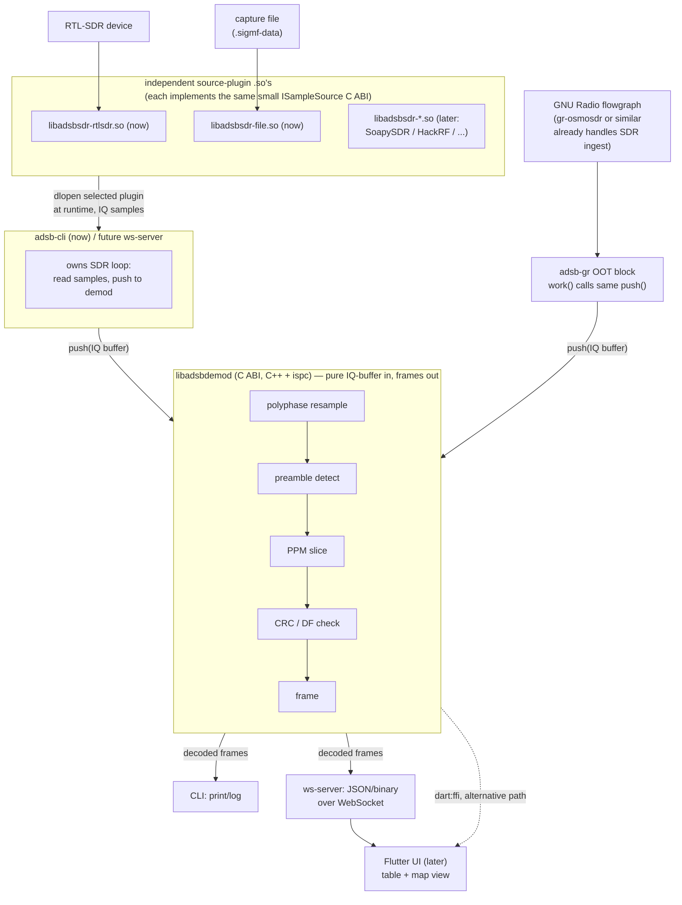
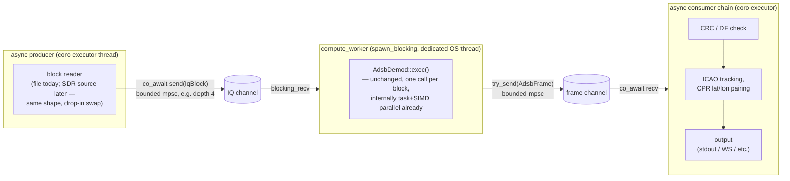

# adsb-demod

A high-performance ADS-B (1090 MHz Mode S) demodulator, ported from a working
Julia prototype ([adsb_detect.jl](adsb_detect.jl), [polyphase.jl](polyphase.jl))
to C++ with an [ispc](https://ispc.github.io/)-vectorized core, exposed as a
shared library with a thin CLI on top for now, and other front ends (Flutter,
WebSocket) later.

## What the algorithm does (from the prototype)

1. **Input**: complex IQ samples (`complex<float>`) from an SDR. The
   prototype is currently hardcoded to 3.2 Msps (the max the test RTL-SDR
   dongle can deliver) sampled around 1090 MHz, but the input sample rate is
   just a parameter to the polyphase resampler and should be a runtime
   config value in the C++ port, not a compile-time constant — different
   SDRs/setups will have different max rates.
2. **Resampling / matched filtering**: a polyphase filter bank
   (`PolyphaseFilterBank` in [polyphase.jl](polyphase.jl)) resamples the IQ
   stream to a fixed rate of **12 samples per Mode S symbol/bit (1 µs)**,
   i.e. 6 samples per half-symbol "chip" (0.5 µs) — the underlying PPM
   pulse-position unit — using a lowpass/Hanning windowed FIR bank with `Np`
   phases and `M` taps per phase. The bank also supports generating
   first/second-derivative taps (`Nd`) for interpolation, though the
   streaming demodulator currently only uses the value tap. Like the input
   rate, 12 samples/symbol is a prototype constant (`Np` in the filter bank,
   `inv_ry`/`ry` and the `*6`/`*12` strides in `exec!`) and should become a
   runtime-configurable parameter in the port, so we can trade off
   timing-resolution vs. throughput and measure the effect on detection
   performance.
3. **Envelope**: magnitude (`abs`) of the resampled complex signal feeds a
   short circular buffer (`y`), 12 samples/symbol (2 samples/chip).
4. **Preamble correlation**: an 8-pulse preamble pattern (16 chips at
   half-symbol resolution, `pat = [1,-1,1,-1,-1,-1,-1,1,-1,1,-1,-1,-1,-1,-1,-1]`)
   is correlated against the last 16 chips' worth of envelope samples at
   each of the sub-symbol phases (`ic` in `1:10`, out of 12 samples/symbol)
   to find the best sample-timing phase and detect a candidate preamble.
5. **PPM bit slicing**: once a preamble is found, each subsequent data bit
   (up to 112 bits for a long frame) is sliced by comparing the envelope at
   the two possible pulse positions within a symbol, half a symbol (6
   samples) apart (`y[j] - y[j+6]`); the sign determines bit 0/1, and the
   summed `|difference|` magnitude is used as a frame-quality/confidence
   metric (`mag > 2*56` threshold).
6. **Output**: a `UInt128` holding the demodulated bits (up to 112 bits,
   right-aligned) plus the sample index where the frame was found.
7. **CRC / validation** (downstream of the demodulator today): Mode S 24-bit
   CRC remainder computation (`crc(M)`), format field (DF) extraction, and
   ICAO/CRC cross-checking for format-dependent validation, plus ICAO
   tracking. Some of this (CRC calc, DF-based frame-length branching) is
   good to keep in the demod library since it is cheap, format-independent,
   and needed to decide whether a candidate frame is worth reporting at all;
   full protocol decode (`pms.decode`, position/track/velocity fields) stays
   out of scope for this project (there are existing ADS-B decoder libs) and
   belongs downstream.

## Design principle: parameterize everything

The prototype has several hardcoded constants (input sample rate, samples/
symbol, detection thresholds, etc.) that were fine for one-off experiments
but shouldn't stay silently hardcoded in the port. As a general rule for
this project: anything in the prototype that's a tunable value rather than
a structural fact of the ADS-B/Mode S waveform (e.g. bit timing, preamble
pattern, and frame lengths are fixed by the spec; filter taps, thresholds,
rates are not) should be exposed as a parameter, with a default equal to
whatever the prototype currently uses, rather than buried as a magic
number. This is both good practice and useful for this project specifically
since part of the point of the port is to empirically test
performance/accuracy tradeoffs across configurations (see AGC/normalization
below).

**"Parameterized" doesn't always mean "runtime-configurable," though.**
Runtime config (a field in `adsb_demod_config_t`) is the default and
preferred option wherever it's cheap — most thresholds, the input sample
rate, filter design choices. But some values are tightly coupled to
performance-critical code shape rather than being a free dial: e.g.
`samples_per_symbol` likely needs to be a **compile-time constant** in the
ispc kernels, because it drives gang width / loop-unrolling / vectorization
strategy directly (see [ispc kernel strategy for a variable
samples/symbol](#ispc-kernels)) — making it a true runtime value would mean
either giving up that vectorization structure or branching across many
compiled variants at runtime, neither of which is worth it just to avoid a
rebuild. For cases like that, a static constant (or small
`#define`/CMake-option-driven set of them) is the right call, as long as
changing it and recompiling to test a different value stays easy — e.g. a
single CMake option or header constant, not something buried across
multiple files. Compile-time-constant parameters should still be treated
as parameters for documentation purposes (defaults noted, not left as
unexplained magic numbers) even though they're not part of the runtime C
ABI.

## Goals

- Port the working prototype to C++ for throughput and to run continuously
  against a live SDR (RTL-SDR now, others later) rather than post-processed
  captures.
- Vectorize/parallelize the hot loops (resampling FIR convolutions, preamble
  correlation, PPM slicing) with ispc, targeting SIMD on CPU first, with an
  eye toward an ispc GPU target (or a CUDA/Metal rewrite of the same kernels)
  later if throughput demands it.
- Ship the demodulator as a **shared library** (`libadsbdemod.so`/`.dylib`/
  `.dll`) with a small, stable C ABI, so it can be:
  - driven from a **CLI** for local testing/development against `.sigmf-data`
    captures or a live RTL-SDR (first deliverable),
  - loaded directly by **Flutter** via `dart:ffi` (no IPC), or
  - wrapped by a **WebSocket/TCP server** for a decoupled Flutter (or any
    other) client, or remote deployment (e.g. Pi near the antenna, UI
    elsewhere on the network).
- Output is a stream of decoded Mode S frames: `UInt128` payload (bit-packed,
  right-aligned like the prototype) + metadata (timestamp, sample index,
  SNR/confidence, maybe frequency offset) — a format that works equally well
  serialized over a socket or read directly out of FFI-shared memory.

## Implementation phasing

Everything below (shared library, C ABI, SDR plugin architecture, GNU Radio
block, Flutter/WebSocket paths) is the target end-state design — useful to
have written down so early decisions don't paint the project into a corner,
but not what gets built first. The actual first coding milestone is much
narrower, since the Julia prototype already proves the algorithm works and a
serial C++ port would just be a detour before the part that's actually
interesting:

- A single monolithic **ispc + C++ CLI prototype**, no shared library split
  and no SDR plugin abstraction yet.
- **IQ input from a file** (`.sigmf-data`, same as the prototype), not a live
  SDR.
- **Filter coefficients from a file** (the raw-file path from [Filter
  coefficient source](#filter-coefficient-source)), not computed at runtime.
- The resample/preamble/slice kernels are written **directly in ispc** —
  skipping a scalar/serial C++ reference implementation entirely, since the
  Julia prototype already serves that validation role.
- Output: decoded frames to stdout, informally compared against the Julia
  prototype's output on the same capture file (formal testing strategy is
  still deferred, per [Open questions](#open-questions--things-to-validate-before-or-during-implementation)).

Once this proves the core parallel algorithm out, the surrounding
architecture (shared library, C ABI, SDR plugins, etc.) gets built up
incrementally around it as described in the rest of this document.

### Phase-0 prototype: current status

The narrow ispc + C++ CLI prototype described above ([proto/](proto/)) is
working end-to-end against `.sigmf-data` captures, validated against the
Julia prototype's CRC pass rate on the same test capture, and has had a
first round of performance work beyond the initial straight port:

- **Multicore, not just SIMD**: `resample_block`, `preamble_scan`, and the
  RMS reduction kernel (below) are all split across ispc `task`/`launch`,
  in addition to each kernel's own SIMD gang parallelism — coarse-grained
  multicore parallelism orthogonal to the vectorization. This required a
  small hand-written task-system runtime (`src/tasksys.cpp`) implementing
  ispc's `ISPCAlloc`/`ISPCLaunch`/`ISPCSync` ABI, since this ispc install
  doesn't ship the reference implementation; fork-join per `launch` call
  rather than a persistent worker pool, chosen for provable correctness
  over a theoretical efficiency edge (see that file's comments).
- **Packed/interleaved kernel input, matching raw SDR output**: the
  resample and RMS-reduction kernels read IQ samples directly in
  interleaved (real, imag, real, imag, ...) layout — the format an SDR
  actually delivers — using ispc's `aos_to_soa2` shuffle-based AoS→SoA
  conversion to get per-lane real/imag values without a gather. This
  replaced an earlier planar (separate real/imag arrays) layout that
  required a host-side deinterleave pass; there is no such pass anymore,
  which matters for the streaming case below since it means no per-chunk
  transpose step is needed between "samples just arrived from the radio"
  and "samples the kernel can consume."
- **Per-block RMS normalization, folded into the resample kernel's
  output**: normalization (see [Software-side AGC /
  normalization](#software-side-agc--normalization) below) is computed by
  its own small parallel-reduction kernel (`sumsq_block`) over whatever
  block of raw samples was just handed to `exec()`, with no state or
  smoothing carried across blocks — each block normalizes independently.
  Because the FIR filter is linear, the resulting scale factor is applied
  once per *output* sample inside `resample_block` rather than as a
  separate full-block pass rewriting every input sample.

At this point the demodulator processes a whole test capture at roughly
6–8x realtime on a 12-thread desktop CPU, and per-stage timing
(`ADSB_TIMING=1`) shows `resample_block` and `preamble_scan` as the two
dominant costs, roughly comparable to each other. The next planned step is
architectural rather than kernel-level — see [Async orchestration: coro
pipeline](#async-orchestration-coro-pipeline-planned) below.

## Proposed architecture



*Layout note: the source-plugin `.so`s and `libadsbdemod` are drawn as
separate subgraphs with the orchestrator (`adsb-cli`/`ws-server`) in
between so the diagram reads top-to-bottom as actual data flow — radio/
file at the top, IQ samples down through whichever source plugin is loaded
and into the demod core, decoded
frames continuing down to CLI/WebSocket/Flutter. Earlier drafts modeled
frame delivery as a callback arrow pointing back up into the box that
called `push`, which is technically accurate (it's a synchronous callback)
but made Mermaid's auto-layout bottom-align the subgraphs and read
confusingly. Modeling frames as continuing downward to distinct consumer
nodes instead avoids that, at the cost of being slightly less literal about
the callback being synchronous — a fine trade for readability here.*

### Repo layout (proposed)

```
adsb/
  core/                     # libadsbdemod: pure IQ-buffer-in, frames-out
    include/adsbdemod.h     # public C ABI header
    src/
      polyphase.{h,cpp}     # filter bank design/build (host-side, one-time)
      demod.{h,cpp}         # ADSBDemod state machine, orchestrates ispc kernels
      crc.{h,cpp}           # Mode S CRC + DF/length helpers
      ispc/
        resample.ispc       # polyphase FIR / resampling kernel
        preamble.ispc        # preamble correlation across phases
        slice.ispc           # PPM bit slicing + magnitude/confidence
    tests/                  # unit tests (Catch2/GoogleTest) vs. Julia reference outputs
  sdr/                      # source-plugin ABI + one independent .so per backend
    include/adsbsdr.h       # stable ISampleSource-style C ABI, shared by all plugins
    rtlsdr/                 # -> libadsbsdr-rtlsdr.so (first target)
      source.cpp
    file/                   # -> libadsbsdr-file.so (raw/sigmf IQ file replay,
      source.cpp            #    used by the CLI for testing and by anyone
                             #    wanting file input without a radio)
    # soapysdr/, hackrf/, ...  # later: new backend = new directory = new .so,
                             # no changes to existing plugins or to the host
  cli/
    main.cpp                # dlopen a source plugin -> libadsbdemod -> stdout/log
  gnuradio/                 # (later) adsb-gr: OOT GNU Radio block wrapping
                             # libadsbdemod directly (bypasses the sdr/ plugins —
                             # GNU Radio owns ingest via its own source blocks)
  bindings/                 # (later) flutter ffi glue, ws-server, etc.
  third_party/ or CMake FetchContent for rtl-sdr, etc.
  CMakeLists.txt
  adsb_detect.jl, polyphase.jl, preamble_detect.jl   # reference prototype, kept for validation
```

### Build

- **CMake** as the build system, with `ispc` invoked via a CMake module
  (either the official `ispc.cmake` or a small custom rule) to compile
  `.ispc` files to object files + an auto-generated header (`*_ispc.h`)
  consumed by the C++ side.
- Target both a static lib (for the CLI, simplest debugging) and a shared lib
  (for FFI/dlopen use from Flutter or other hosts) from the same sources.
- `ADSB_SAMPLES_PER_SYMBOL` (default 12, matching the prototype) is a CMake
  option baked into the build as a compile-time constant consumed by the
  ispc kernels — see [ispc kernels](#ispc-kernels) for why this one stays
  compile-time instead of runtime-configurable. Changing it means
  reconfiguring/rebuilding, which is an intentional, accepted tradeoff for
  this particular value.
- SDR device I/O lives in independent per-backend plugin shared libraries
  (`sdr/`, see [Sample ingest / SDR abstraction](#sample-ingest--sdr-abstraction)
  below), not part of the core. `libadsbdemod` only knows about IQ sample
  buffers, never device I/O, and has no librtlsdr (or other SDR library)
  dependency — this keeps it embeddable anywhere a buffer of samples can
  come from (a file, a socket, a GNU Radio block, Flutter over FFI), and
  keeps the ispc/vectorization work isolated from hardware-integration
  churn and from any one backend's build dependencies.

### Public C ABI (sketch)

Kept intentionally small/opaque so it's easy to bind from Dart FFI, and easy
to wrap in a WebSocket layer:

```c
typedef struct adsb_demod adsb_demod_t;

// samples_per_symbol is NOT in this struct: it's a compile-time constant
// (see #define ADSB_SAMPLES_PER_SYMBOL / CMake option in the Build section)
// because the ispc kernels' gang width/unrolling are built around it.
// Testing a different value means rebuilding with a different constant,
// not passing a different config at runtime — see "Design principle:
// parameterize everything" for why that's an intentional exception.
// How the polyphase filter bank's coefficients are obtained — see
// "Filter coefficient source" below for why this is staged rather than
// jumping straight to a C++ filter-design implementation.
typedef enum {
    ADSB_FILTER_SOURCE_RAW_FILE,  // stage 1 (first): flat binary + sidecar
                                    // metadata file, e.g. exported from the
                                    // Julia PolyphaseFilterBank for exact
                                    // Julia/C++ parity while prototyping
    ADSB_FILTER_SOURCE_HDF5_FILE, // stage 2: self-describing, preferred
                                    // long-term interchange format
    ADSB_FILTER_SOURCE_COMPUTE,   // stage 3: native C++ port of the
                                    // Hanning-windowed lowpass FIR design,
                                    // no external file needed
} adsb_filter_source_t;

typedef struct {
    adsb_filter_source_t source;
    const char* path;    // required for *_FILE sources; ignored for COMPUTE
} adsb_filter_config_t;

typedef struct {
    double sample_rate_hz;       // input IQ rate, e.g. 3.2e6 for the test RTL-SDR
    adsb_filter_config_t filter; // polyphase filter bank coefficient source
    float preamble_score_min;    // default matches prototype's `c < 3` cutoff
    float slice_magnitude_min;   // default matches prototype's `mag > 2*56` cutoff
    unsigned ispc_chunk_samples; // internal fixed-size processing chunk for
                                  // the vectorized kernels; independent of
                                  // caller's push() buffer sizes (default ~8192,
                                  // matching the prototype's read size)
    // normalization strategy selector + params (see AGC/normalization section)
    // — defaults match the prototype
} adsb_demod_config_t;

adsb_demod_t* adsb_demod_create(const adsb_demod_config_t* config);
void adsb_demod_destroy(adsb_demod_t*);

// Push a block of interleaved complex<float> IQ samples, assumed to be
// contiguous with (immediately follow) the samples from the previous
// push() call. Decoded frames are delivered via the callback,
// synchronously, before return.
typedef struct {
    uint64_t sample_index;   // sample index (monotonic) where frame was found
    double   timestamp_sec;  // wall-clock or capture-relative time
    unsigned num_bits;       // 56 or 112
    __uint128_t payload;     // right-aligned demodulated bits (matches Julia UInt128)
    float    confidence;     // magnitude/quality metric from PPM slicing
} adsb_frame_t;

typedef void (*adsb_frame_cb)(const adsb_frame_t* frame, void* user_data);

void adsb_demod_push(adsb_demod_t*, const float* iq_interleaved, size_t num_samples,
                      adsb_frame_cb cb, void* user_data);

// Call before the next push() whenever the caller knows (or suspects, e.g.
// from an SDR buffer-overflow indicator) that the upcoming samples are NOT
// contiguous with whatever was pushed last — a dropped-samples gap. Clears
// all stream-position state (the raw-IQ and envelope circular buffers plus
// the resampling phase/timing accumulators — everything adsb_demod_create()
// initializes fresh) so the next push() starts clean instead of assuming
// continuity across the gap. Filter bank / config are untouched.
// `next_sample_index` re-anchors sample_index in subsequently reported
// frames to the real stream position, so it doesn't silently drift by
// however many samples were actually dropped during the gap.
void adsb_demod_reset(adsb_demod_t*, uint64_t next_sample_index);
```

`__uint128_t` is a GCC/Clang extension (fine for the CLI and a native Flutter
FFI plugin); for the WebSocket layer or any host without 128-bit int support,
frames get serialized as two `uint64_t`s or a 14-byte big-endian blob instead
— the C ABI stays `__uint128_t`/`uint64_t[2]` and serialization is purely a
concern of the transport layer, not the core.

**Streaming state and gap handling.** `adsb_demod_t` treats its input as
one logically continuous, unbounded IQ stream, delivered in arbitrary-sized
chunks purely as an artifact of how the caller happens to read it (an SDR
buffer size, a GNU Radio `work()` call, a file read) — it is not a sequence
of independent blocks. Internal state (raw-IQ and envelope circular
buffers, resampling phase/timing accumulators) persists across `push()`
calls specifically so a preamble or frame that straddles a chunk boundary
is still detected, matching how the prototype's `ADSBDemod`/`exec!` design
already works. This assumes each `push()`'s samples are contiguous with the
previous call's; when they're not — the input skipped ahead because
something couldn't keep up (SDR USB overflow, a full ring buffer, a
GNU Radio discontinuity, a WebSocket reconnect) — the caller must say so by
calling `adsb_demod_reset()` before the next `push()`, since only the
ingest side can know a gap happened; the demod core has no reliable way to
infer "these samples aren't actually adjacent to the last ones" purely by
inspecting IQ values. This does mean every `ISampleSource` plugin needs
*some* way to surface "gap since last read" back to its host (even a
simple bool from the read call is enough) for the host to forward into
`adsb_demod_reset()` — worth keeping in mind as the plugin ABI
(`sdr/include/adsbsdr.h`) is designed.

### Streaming and chunking: one push API, an internal fixed-size chunk for ispc

There's only one ingest API into `libadsbdemod` — `adsb_demod_push(IQ
buffer)` — used identically by the CLI, the future ws-server, *and* the
future `adsb-gr` GNU Radio block. That's possible because GNU Radio's
OOT block model turns out to already match the shape the prototype uses:

- A GNU Radio block's `work()` is called repeatedly by the scheduler with
  however many samples are currently available in its input buffer
  (`noutput_items`, bounded by buffer size) — it's a pull-based streaming
  model, not something that hands you neat fixed-size chunks by default
  (though `set_output_multiple()`/`set_history()` can constrain the
  granularity if a block wants that). So an `adsb-gr` block's `work()`
  would just forward whatever it's given straight into
  `adsb_demod_push()` — the same call the CLI makes with whatever it reads
  from a loaded source plugin or a file.
- This is also exactly what the prototype already does: `exec!` is written
  to accept an arbitrary-length `x` and internally advance through a
  circular buffer, so it never assumed a fixed input block size — the
  8192-sample reads in the live-capture path were just a convenient
  librtlsdr read size, not a structural requirement. The C++ port keeps
  that property: `adsb_demod_push` accepts any buffer length, and
  `adsb_demod_t` owns persistent circular-buffer state across calls so
  frames aren't lost or duplicated at push boundaries.

That means the "I want fixed-size chunks so ispc can vectorize/parallelize
over them" goal isn't actually about the ingest API shape — it's about
what the library does *internally* once samples land in its buffer. The
plan: `adsb_demod_push` appends incoming samples to the internal circular
buffer as today, but the resample/preamble/slice ispc kernels run over an
**internal, configurably-sized fixed chunk** (e.g. defaulting to something
in the range of the prototype's 8192-sample reads, exposed as a config
parameter per [Design principle: parameterize everything](#design-principle-parameterize-everything))
whenever enough buffered samples are available — regardless of how big the
caller's individual `push()` calls happen to be. A GNU Radio `work()` call
with 200 samples and a file-replay `push()` with 65536 samples both just
feed the same buffer; the ispc chunk size is a separate, independently
tunable value from either of those. This also keeps latency reasonable for
live streaming (frames get emitted as soon as a chunk's worth of new
samples has been processed) without coupling the vectorization granularity
to whatever block size a particular caller happens to use.

### Async orchestration: coro pipeline (planned)

The phase-0 prototype today (`proto/src/main.cpp`) loads an entire capture
file, then makes one synchronous `AdsbDemod::exec()` call over the whole
thing. That's fine for a debugging/benchmarking tool working over a fixed
file, but doesn't reflect the real target: an unbounded, continuous stream
of blocks (from a live SDR, or from a file being replayed as if it were
one) feeding the demodulator forever. The next architectural step —
**not yet implemented, this section is design, not status** — is to
restructure that loop using **coro** (`/home/brad/sandbox/coro`, this
team's own C++20 coroutines library, modelled on Tokio), rather than by
parallelizing across the demod pipeline's own internal stages.

**Why not pipeline the kernel stages themselves.** The obvious-looking
alternative — start block N+1's RMS reduction while block N's resample is
still running, etc., so multiple pipeline stages are in flight
concurrently — was considered and rejected. Every kernel in `exec()`
already spawns enough ispc tasks to saturate every hardware thread on its
own (see [Phase-0 prototype: current
status](#phase-0-prototype-current-status) above); there's no idle core
capacity left for a second, differently-shaped kernel to fill by running
alongside it. Running two already-fully-threaded stages concurrently would
just have them contend for the same core count with different memory
working sets (padded IQ + filter taps vs. the `y[]` envelope array vs. the
preamble pattern), which is far more likely to *increase* the cache-miss
rate than to help. `exec()` stays a single, sequential, atomic call per
block — the same shape it is today, unchanged internally.

**Where async orchestration genuinely helps instead: overlapping I/O with
compute, not compute with compute.** This is exactly the pattern coro's
own `doc/getting_started.md` documents (section "Feeding a compute loop
for CPU-bound work," and its GPU-transfer extension): a tightly-coupled,
CPU-bound compute loop that can't be usefully split further internally is
wrapped as one opaque unit on a dedicated thread (`spawn_blocking`), and
coro's job is limited to making sure that thread is never idle waiting on
I/O — reading the next block, delivering the previous block's results —
by running that I/O concurrently with the compute call via ordinary async
coroutines on coro's executor. I/O (file reads today; USB/network reads
from a live SDR later) and CPU-bound, already-fully-threaded compute are
genuinely different resources, so overlapping *those* two is free
throughput, unlike overlapping compute with compute above.



A few properties fall out of this shape without extra work:

- **Natural backpressure, and near-zero-cost I/O overlap.** The IQ channel
  is bounded, so the reader coroutine suspends automatically once it's a
  few blocks ahead of the compute thread — no explicit rate-limiting
  logic needed. When compute is the bottleneck (the expected case), the
  next block is already sitting in the channel the instant
  `compute_worker` asks for it, so file-read (or, later, SDR-ingest)
  latency is fully amortized under compute time, the same way the GPU
  H2D-transfer overlap in coro's getting_started guide amortizes transfer
  latency under kernel execution.
- **File replay and live SDR ingest become the same producer shape.**
  Swapping the file-reading coroutine for one that pulls blocks from a
  live RTL-SDR (or another backend, per [Sample ingest / SDR
  abstraction](#sample-ingest--sdr-abstraction) below) changes nothing
  downstream of the IQ channel — `compute_worker` and the whole consumer
  chain are unaware of where blocks came from. This is the same
  decoupling goal the `adsb_demod_push`/`ISampleSource` design already
  aims for, just realized as a channel boundary instead of a callback.
- **The consumer chain is genuinely async-appropriate work**, not
  compute-bound: CRC computation, DF-based validation, ICAO
  tracking/matching (e.g. pairing odd/even DF17 frames for CPR position
  decoding), and output are all cheap per-frame bookkeeping, so they run
  as ordinary coroutines on coro's executor rather than needing their own
  `spawn_blocking` thread.

This is deliberately independent of — and can land before or after —
the shared-library/C-ABI/SDR-plugin work described elsewhere in this
document. It first replaces `proto/src/main.cpp`'s single-shot
whole-file loop with a chunked file-replay producer (validating the
pipeline shape against the same test capture and CRC pass rate used
today), and the live-SDR producer is a later, mostly-mechanical swap
once this shape is proven out.

### Sample ingest / SDR abstraction

`libadsbdemod` never touches a radio — it only consumes IQ sample buffers
via `adsb_demod_push`. Where those buffers come from is a separate concern,
and it splits into two genuinely different cases:

1. **We own the radio** (CLI, future Flutter app, future WebSocket server):
   something has to open the device, configure sample rate/frequency/gain,
   and pull samples in a loop. Rather than one `libadsbsdr` library with
   every backend statically linked in, each SDR backend is its **own**
   small shared library implementing a single stable `ISampleSource`-style
   C ABI (open/configure/read/close) defined once in `sdr/include/adsbsdr.h`:
   `libadsbsdr-rtlsdr.so` (first target, matches the test hardware),
   `libadsbsdr-file.so` (raw/SigMF file replay, so the CLI can use the same
   code path for live capture and file testing), and later
   `libadsbsdr-soapysdr.so` / `libadsbsdr-hackrf.so` / etc. A host
   (`adsb-cli`, the future ws-server, Flutter over FFI) picks one at
   startup/config time and `dlopen()`s it — adding a new SDR means writing
   and shipping one new `.so` against the existing ABI header, not touching
   `libadsbdemod`, the host, or any other backend's plugin. This is
   basically the same idea as GNU Radio's own block model — small,
   single-purpose, independently loadable units behind a common
   interface — just applied to sample sources and kept independent of GNU
   Radio itself, so it works for the CLI/Flutter/WS use case too.
2. **Something else already owns the radio** (GNU Radio): the planned
   `adsb-gr` OOT block wraps `libadsbdemod` directly and does *not* go
   through the `sdr/` plugin ABI at all — GNU Radio's own source blocks
   (e.g. `gr-osmosdr`, which already supports RTL-SDR and other backends)
   handle device I/O and hand the block a stream of IQ samples; the block's
   `work()` function just forwards them to `adsb_demod_push` and emits
   decoded frames (as a GNU Radio message port, most likely). This is a
   nice validation of the "core library only needs a buffer" design, and
   gets GNU Radio flowgraph interop close to free once the core library
   exists.

So `libadsbdemod` (the demod core, this project's main focus) stays
independent of every SDR backend and of GNU Radio, and each SDR backend
stays independent of every other backend and of the demod core. The one
thing they share is the small `adsb_frame_push`-style buffer contract into
`libadsbdemod`, and, among sample sources, the `sdr/include/adsbsdr.h`
plugin ABI. Keeping backends as separate `.so`s also means an individual
backend's build dependencies (librtlsdr, SoapySDR, whatever HackRF needs)
never leak into anything else's build, and a broken/missing backend at
runtime doesn't affect the others.

*Scope note:* it's fair to see this whole system — swappable source
plugins feeding a fixed demod core feeding swappable output consumers — as
a small, special-case "flow graph," conceptually similar to GNU Radio's.
Worth naming explicitly so it doesn't happen by accident: the intent here
is *not* to build a general-purpose dataflow/scheduler framework in-house.
The graph stays fixed and simple — exactly one source plugin feeding
`libadsbdemod`, which feeds one or more fixed output consumers (CLI, WS,
Flutter) — with genericity limited to "the source is swappable via a
common ABI." If a use case ever needs arbitrary block composition, that's
what the GNU Radio integration is for; reimplementing GNU Radio's scheduler
ourselves is explicitly out of scope.

The `adsb-gr` GNU Radio block is a later nice-to-have, not part of the
first iteration — noted here mainly so the core library's "just a buffer
in, frames out" API shape stays compatible with it from the start rather
than accidentally coupling itself to the `sdr/` plugin ABI or a specific
ingest model.

### Filter coefficient source

`PolyphaseFilterBank` construction (in [polyphase.jl](polyphase.jl)) is the
one piece of the prototype that leans on a real DSP library (`DSP.jl`'s
`digitalfilter`, `hanning`, `xcorr`) rather than being simple arithmetic —
everything downstream of the coefficient table (`h`) is straightforward
dot-product/correlation code with an obvious C++/ispc translation. Rather
than block the C++ port on first re-implementing Hanning-windowed FIR
design in C++, coefficient sourcing is staged and configurable
(`adsb_filter_config_t.source` in the ABI sketch above), so the demod core
and ispc kernels can be built, tested, and validated against the coefficient
table Julia already computes, well before the design routine itself is
ported:

1. **Raw file import (first target)**: `libadsbdemod` loads precomputed
   coefficients from a flat binary file (matching the `h` array's layout:
   `M+2Nd` taps × `Np` phases × 1 or 3 planes, `float32`/`float64` as
   written) plus a small sidecar metadata file (JSON or plain text —
   `M`, `Np`, `Nd`, dtype, and whatever design parameters are worth
   recording for reproducibility) describing its shape, since a raw
   binary blob alone doesn't self-describe its dimensions. A short Julia
   helper script (`write(io, p.h)` plus the sidecar) exports a
   `PolyphaseFilterBank` built in Julia straight to this format. This is
   the important one for prototyping: when tuning the filter design in
   Julia, exporting and loading the *exact* coefficients into the C++
   build eliminates "did the C++ port introduce a subtly different filter"
   as a variable when comparing Julia vs. C++ detection behavior on the
   same capture — CSV was considered too but raw binary matches the
   prototype's existing IQ-file convention (`read!`/`write`) and avoids
   text-parsing/precision-loss concerns.
2. **HDF5 import (preferred long-term interchange format)**: same idea,
   self-describing instead of needing a sidecar file, and a more natural
   fit if filter coefficients ever need to travel alongside other
   structured data (e.g. bundled with a capture or a test fixture). Adds
   an HDF5 library dependency, so it's a later addition once the raw-file
   path has proven the loader plumbing out.
3. **Runtime computation in C++ (eventual default)**: a native port of the
   Hanning-windowed lowpass FIR design, removing the Julia/file dependency
   entirely for normal (non-debugging) use. Lower priority than getting
   the demod core itself working, since the file-import paths already
   unblock that.

Loaded/computed coefficients must match the compiled-in
`ADSB_SAMPLES_PER_SYMBOL` (`Np`); the loader validates this and fails
loudly on a mismatch rather than silently reinterpreting the array.

### ispc kernels

The three inner loops from the prototype map fairly directly onto ispc
`foreach`/gang-parallel kernels. `samples_per_symbol` (`Np`, default 12) is
a **compile-time constant** (`ADSB_SAMPLES_PER_SYMBOL`, see
[Build](#build)) here rather than a runtime parameter — per [Design
principle: parameterize everything](#design-principle-parameterize-everything),
it's tightly coupled to gang width/loop-unrolling in these kernels, so
sweeping it means reconfiguring and rebuilding with a different constant,
not passing a different value at runtime. `sample_rate_hz` stays a genuine
runtime parameter (it doesn't change kernel shape, only the filter
coefficient table computed on the host):

- **`resample.ispc`**: for each output symbol-rate sample, a dot product of
  `M` filter taps (loaded/computed per [Filter coefficient
  source](#filter-coefficient-source), sized for the compiled-in `Np`)
  against a window of input IQ samples. Natural vectorization axis: compute
  multiple output samples (or multiple polyphase branches) per gang. Since
  the filter design depends on the runtime `sample_rate_hz` (and the
  compiled-in `Np`), the coefficient table is loaded/computed once per
  `adsb_demod_create()` call and passed into ispc as flat arrays, rather
  than baked in as one fixed constant table.
- **`preamble.ispc`**: correlate the fixed 16-chip preamble pattern against
  the last 16 chips' worth of envelope samples at each of the tested
  sub-symbol phases (`Np`-dependent, ~10 out of 12 in the prototype); natural
  vectorization axis is across phases (SIMD lanes = phase candidates,
  gang width driven by the compiled-in `Np`), producing the best-phase
  index + score per evaluation.
- **`slice.ispc`**: given a locked phase, slice up to 112 PPM bits in
  parallel (each bit only needs two envelope samples half a symbol apart)
  and reduce to the packed bits + magnitude sum. This one benefits most from
  wide vectorization since 112 independent bit comparisons is very
  SIMD-friendly.

Longer term, since ispc also has an experimental GPU/`ispc -mgpu` path, and
these kernels are simple, mostly-independent, data-parallel operations, they
should port to a real GPU backend (CUDA/Metal/Vulkan compute) later without
much conceptual change if CPU throughput isn't enough — worth validating
early whether CPU SIMD alone is sufficient for the target sample rates
before investing there.

### CLI (first deliverable)

`adsb-cli` should support at minimum:

- `--file <path.sigmf-data>` — read a captured IQ file (reusing the existing
  `.sigmf-meta` for sample rate/format) and run the demodulator over it,
  printing decoded frames (hex payload, DF, ICAO if CRC valid, confidence).
- `--rtlsdr` (behind a build flag / optional dependency) — live capture via
  librtlsdr, same output path.
- Options to dump intermediate stats (frame rate, CRC pass rate) for
  regression-testing against the Julia prototype's output on the same
  capture file.

### Path to Flutter (not building yet, just keeping the door open)

Two integration options, both supported by the architecture above without
changes to the core library:

1. **Direct FFI**: Flutter app links `libadsbdemod` directly via `dart:ffi`,
   calls `adsb_demod_push` with samples read from a file/socket/USB, gets a
   Dart callback per frame. Lowest latency, single-process, good for a
   desktop/embedded (e.g. Raspberry Pi) deployment where UI and demod run
   together.
2. **WebSocket server**: a small C++ (or reuse the CLI's plumbing) process
   wraps `libadsbdemod`, sources samples (file or RTL-SDR), and streams
   decoded frames as JSON or a compact binary frame format over a
   WebSocket. Flutter (or any other client, including a web dashboard)
   connects remotely. Good for "antenna box on the roof, UI on a laptop/
   phone" deployments.

Both consume the same `adsb_frame_t` stream, so building #2 later is mostly
a serialization + networking task, not a redesign.

## Software-side AGC / normalization (open-ended — document current approach, revisit later)

Distinct from any tuner/radio-side AGC (which is disabled in the prototype's
live-capture path, `set_agc_mode`/`set_tuner_gain_mode` set to 0/manual):
after reading a block of IQ samples, the prototype estimates the noise
floor as the RMS magnitude of the raw samples, `sqrt(mean(abs2.(x)))`, and
divides the IQ block by that value before any filtering/detection. This
normalizes the average noise magnitude to roughly 1, which is what lets the
downstream preamble-correlation and bit-slicing magnitude thresholds
(`c < 3`, `mag > 2*56`, etc.) be simple hardcoded-ish constants instead of
needing to be rescaled per capture/session.

This is a reasonable, simple starting point but is very much an open
problem rather than a settled design:

- It's a block-level (whole-capture or whole-chunk) estimate, not adaptive
  within a block or across time — a noise floor that drifts during a long
  live-capture session isn't tracked.
- RMS-over-the-whole-block conflates noise with signal energy — a very busy
  RF environment (lots of concurrent transmissions) would bias the estimate
  upward and could suppress sensitivity to weaker signals.
- No outlier/robust estimation (e.g. median-based) is used, so a single
  strong transmission in the block could skew the normalization for the
  rest of it.

For the port: keep the same RMS-normalization approach as the default
(computed per input block pushed to the demodulator), but treat the
normalization strategy itself as swappable/parameterized rather than
fixed, so alternatives can be tested empirically against the same capture
data later.

**Decided: per-block, independently computed, no cross-block smoothing.**
The phase-0 prototype implements exactly this today — a parallel-reduction
kernel (`sumsq_block`) computes RMS from each block's own raw samples only,
with no running/exponentially-smoothed estimate carried across blocks.
An EMA-smoothed estimate was considered specifically to avoid a
discontinuity for a frame straddling a block boundary, and rejected: if
the receiver's own AGC steps mid-stream, that step won't land on a block
boundary either, so there's no single "correct" value a block has to
begin with in that case — smoothing would just delay reacting to a real
level change rather than fix the discontinuity. Preferred failure mode is
to miss/mis-decode whichever block a real level change lands in, then
normalize correctly from the next block on, rather than lag behind every
block trying to avoid that. This can be revisited if it proves to be a
real problem in practice, but isn't expected to be one.

Still open:

- Robust statistics (median or percentile-based magnitude) instead of RMS,
  to reduce sensitivity to strong in-block signals.
- Whether normalization should live inside `libadsbdemod` at all vs. being
  a preprocessing step the caller (CLI/FFI host) applies before pushing
  samples — keeping it in the library is simpler for now (one thing to
  configure, consistent behavior across CLI/FFI/WS callers) but worth
  reconsidering if callers want more control.

As with other tunables, the detection thresholds that currently rely on
this normalization (preamble correlation score, PPM slice magnitude, and
any others found during porting) should be configurable parameters with
defaults matching the prototype's hardcoded values, not fixed constants —
see [Design principle: parameterize everything](#design-principle-parameterize-everything).

## Open questions / things to validate before or during implementation

- **`sdr/include/adsbsdr.h` plugin ABI shape & versioning**: confirm RTL-SDR
  is the only near-term backend target (it is, for now — matches the test
  hardware), and whether the `ISampleSource` ABI should be designed up
  front with SoapySDR/HackRF in mind or kept minimal and reshaped when a
  second backend is actually added. Since backends are now independent
  `.so`s loaded via `dlopen()` rather than compiled into one library, the
  ABI also needs a versioning/compatibility story (e.g. an API version
  field the host checks after loading) so a host and a backend built at
  different times fail loudly instead of silently misbehaving. It also
  needs to carry a per-read "gap since last read" signal (see [Streaming
  state and gap handling](#public-c-abi-sketch)) so hosts can drive
  `adsb_demod_reset()` correctly.
- **Testing strategy**: plan to validate the C++/ispc core against the
  Julia prototype by running both over the same `.sigmf-data` capture and
  diffing decoded frames (sample index + payload), not just unit-testing
  kernels in isolation.

## Non-goals (for this library)

- Full Mode S/ADS-B protocol decode (position, velocity, callsign, etc.) —
  belongs downstream of this library, either in the Flutter app or a
  separate decode library.
- A UI of any kind — this repo is the demod core + CLI + (later) transport
  layer only.
