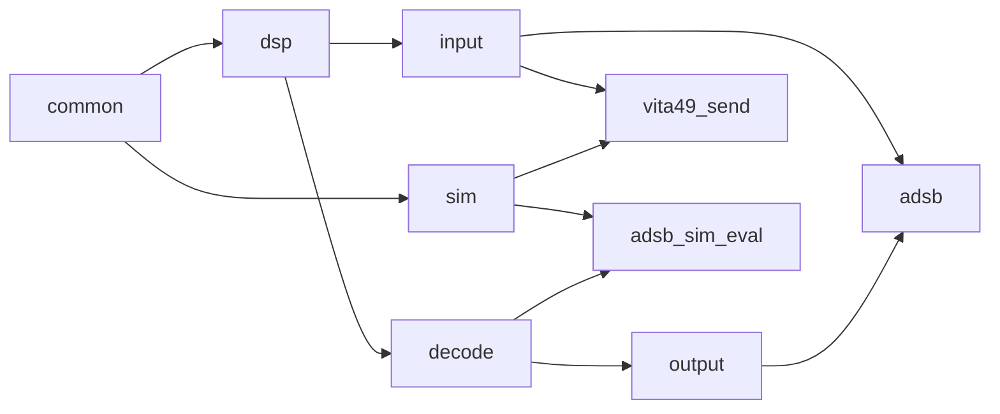
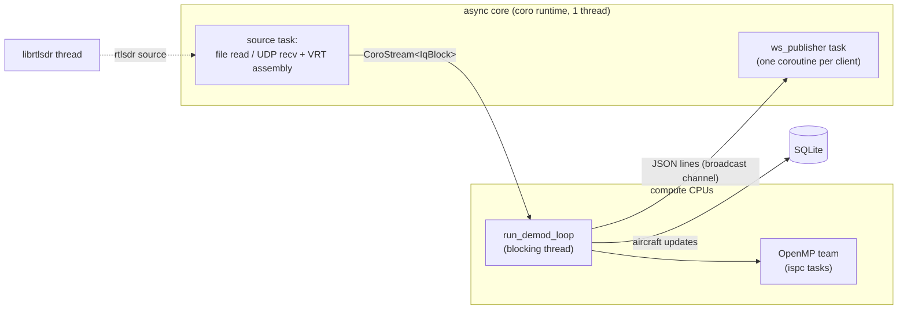
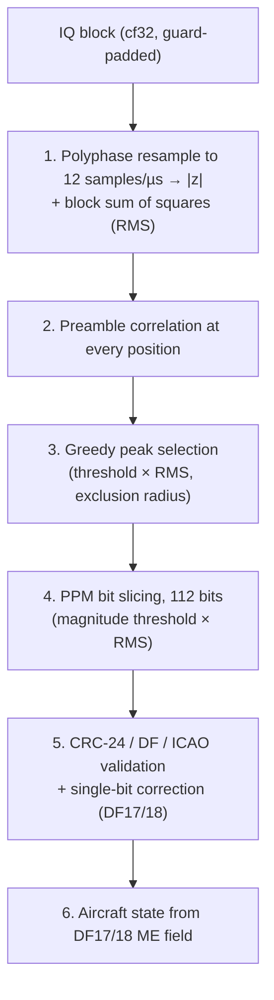

# adsb-demod

An ADS-B (1090 MHz Mode S) receiver. It reads IQ samples from a SigMF
recording, a VITA-49 (VRT) UDP stream or a live RTL-SDR. It demodulates Mode
S frames with an [ispc](https://ispc.github.io/)-vectorized, multithreaded DSP
core, validates and decodes them, and tracks aircraft state. Results go to a
WebSocket that feeds a Flutter map UI, and optionally to a SQLite history that
the UI can scrub back through and to an HDF5 file for offline analysis.

The repository holds:

- **`adsb`**, the receiver (C++, in [src/apps/adsb](src/apps/adsb)).
- **`vita49_send`**, a test source that streams IQ as VITA-49 over UDP. The IQ
  comes from an RTL-SDR or from a built-in ADS-B signal simulator. It stands
  in for a VITA-49 SDR front end for `adsb vita49`, and its simulator can drive
  the receiver at up to 200 Msps.
- **`adsb_sim_eval`**, which runs the simulator straight into the demodulator
  and scores the output against the simulator's ground truth.
- **The UI** ([ui/frontend](ui/frontend)), a Flutter app with a map, an
  aircraft table, a frame log, a spectrum waterfall and a history scrubber.
- **The Julia prototype** ([adsb_detect.jl](adsb_detect.jl),
  [polyphase.jl](polyphase.jl), [adsb.jl](adsb.jl),
  [preamble_detect.jl](preamble_detect.jl)) that the C++ code was developed
  from. The C++ resampling filter still uses the design in
  [polyphase.jl](polyphase.jl).
- **[prototype/](prototype)**, a cleaned-up Julia implementation of the
  demodulator for debugging individual frames at the REPL. It reads SigMF,
  raw IQ or a `--debug-h5` file, computes what `AdsbDemod` computes stage by
  stage and plots it. Start from [prototype/examples.jl](prototype/examples.jl).

## Building

### Prerequisites

- A C++23 compiler (GCC is the one in use), CMake and OpenMP.
- [`ispc`](https://ispc.github.io/), the vectorizing compiler for the DSP
  kernels. Put it on `PATH`, or set `ISPC_ROOT` to its install directory.
- [Conan 2](https://docs.conan.io/2/), which supplies every library
  dependency (see below).

### Conan

Conan is a package manager for C/C++. Each project declares the libraries it
needs in a `conanfile.py`, which for adsb is
[conanfile.py](conanfile.py).

- `conan install` resolves those libraries and builds any that aren't built
  yet.
- Packages are fetched from *remotes*, the default remote being ConanCenter.
- Built packages are stored in a *local cache* under `~/.conan2`.
- `conan install` also writes a CMake toolchain and CMake presets, so CMake
  can find the libraries.

The libraries adsb uses:

- `argparse`, `nlohmann_json`, `fftw`, `sqlite3`, `xtensor` and `highfive`
  come from ConanCenter automatically.
- `librtlsdr` and `coro` aren't on any public remote, so you add them to your
  local cache yourself (below).

#### One-time Conan setup

```sh
pip install conan          # or: pipx install conan
conan profile detect       # writes ~/.conan2/profiles/default for your compiler
```

adsb and coro are C++23, so edit `~/.conan2/profiles/default` and set
`compiler.cppstd=gnu23`. The dependencies are then built with the same
language standard.

#### Add librtlsdr and coro to the local cache

Run these once, and again whenever either package changes.

**librtlsdr.** Its recipe lives in this repository and downloads the upstream
osmocom source when it is built:

```sh
conan export conan-recipes/librtlsdr
```

`conan export` only copies the recipe into the cache. The library itself is
built by the `--build=missing` step in [Compile and test](#compile-and-test).

**coro.** coro is the coroutine and async-IO runtime developed alongside this
project, in its own repository. From a checkout of it:

```sh
cd <path to coro>
conan create . --version=0.1.2+dev
```

`conan create` builds coro and puts it in the cache.

- **Why the explicit version.** adsb accepts any coro version, but Conan
  ignores prerelease versions when matching a range like that. Without
  `--version`, an untagged coro commit gets a prerelease version, which adsb
  would silently skip.
- **Choosing the version.** Pick one patch above coro's latest release tag:
  `git -C <path to coro> describe --tags` shows that tag.
- **Picking up coro changes.** Re-run `conan create` with a higher version,
  e.g. `0.1.3+dev`, since Conan picks the newest version in the cache.
- **Working on both projects at once.** Register coro as an *editable* package
  instead, so adsb builds against your coro working tree directly:
  `conan editable add . --version=0.1.2+dev`. Remove it again with
  `conan editable remove .`.

coro's `doc/versioning.md` covers this in detail.

### Compile and test

```sh
conan install . --build=missing      # build missing dependencies, generate CMake presets
cmake --preset conan-release
cmake --build build/Release -j
ctest --test-dir build/Release
```

The first `conan install` builds every dependency from source that has no
prebuilt binary for your profile. That run takes a while; later runs reuse
the cache.

The executables (`adsb`, `vita49_send`, `adsb_sim_eval` and `udp_bench`) end
up in `build/Release/`.

CMake cache options:

| Option | Default | Meaning |
|---|---|---|
| `ADSB_SAMPLES_PER_SYMBOL` | 12 | Resampled rate in samples per 1 µs Mode S symbol. Compiled into the kernels. |
| `ADSB_ISPC_TARGET` | *(autodetect)* | ispc `--target` override, e.g. `avx2-i32x8`, to compare against AVX-512. |

### The UI

```sh
cd ui/frontend
flutter run -d linux     # or -d chrome
```

The UI connects to `ws://127.0.0.1:8765`, so run `adsb` with `--ws-port 8765`.

## Running

From the repository root:

```sh
# Replay a recording (the sample rate comes from the .sigmf-meta)
build/Release/adsb file --iq capture.sigmf-data

# Live from an RTL-SDR, publishing to the UI and recording history
build/Release/adsb --ws-port 8765 --history-db history.sqlite rtlsdr --gain 40

# Simulated traffic over VITA-49/UDP: the receiver in one terminal...
build/Release/adsb --rate 10e6 --ws-port 8765 vita49 --port 4991
# ...the sender in another
build/Release/vita49_send --rate 10e6 --dest-port 4991 sim --scenario scenarios/boston.json

# No input: serve a recorded history database to the UI
build/Release/adsb --ws-port 8765 --history-db history.sqlite serve

# Detection statistics against the simulator's ground truth
build/Release/adsb_sim_eval --scenario scenarios/boston.json --snr-db 20 --duration 20
```

`adsb` and `vita49_send` take their options in this order:

1. global options;
2. a source subcommand (or `serve`, for `adsb`);
3. that source's options.

`<program> <subcommand> --help` lists a source's options. Ctrl+C stops either
program cleanly.

## Repository layout

```
adsb/
  *.jl                     the original Julia prototype (kept for reference; superseded by prototype/)
  prototype/               Julia reference implementation of the demodulator, for debugging frames at the REPL
  conan-recipes/librtlsdr  local Conan recipe for librtlsdr
  ui/frontend/             Flutter UI (map, aircraft table, frame log, waterfall, scrubber)
  CMakeLists.txt, conanfile.py   the C++ build
  src/
    common/   constants, cpu_layout (CPU split), tasksys.cpp (ispc task runtime on OpenMP)
    dsp/      demod, peak_select, filter_bank, spectrum, iq_block (block + stitcher), kernels.ispc
    decode/   frame_decode (CRC, DF, ICAO), aircraft (callsign/altitude/CPR position/velocity, Comm-B)
    input/    file_stream, vita49_stream + vrt_assembler + iq_block_chunker,
              rtlsdr_stream + rtlsdr_device, sigmf_meta
    output/   ws_publisher (WebSocket fan-out), aircraft_history (SQLite), frame_recorder (debug HDF5)
    sim/      adsb_sim (Mode S signal simulator), sim_kernels.ispc
    apps/
      filter_options.h  resampling-filter command-line options
      adsb/             the receiver: main.cpp (CLI), pipeline.{h,cpp} (demod loop, per-frame handling)
      vita49_send/      VRT/UDP sender: main.cpp (CLI), rtlsdr_source / sim_source (the two sources),
                        vrt_encode (VRT packets, timestamps, context packets)
      adsb_sim_eval/    simulator -> demodulator detection statistics
  tests/      ctest tests, vrt_to_sigmf.py; tests/data holds captures (not in git)
  filters/    example filter coefficient files + export_filter.jl
  scenarios/  simulator scenarios (boston.json)
  doc/design/ vita49-format.md (the VRT wire format both ends implement)
  tools/      udp_bench.cpp (UDP microbenchmark), udp_sink.c (UDP receive diagnostics),
              debug_h5.jl (offline rerun of --debug-h5 frames)
```

Each `src/` directory builds as one static library. Headers sit next to their
sources and are included as `"dir/name.h"`. Module internals live in anonymous
namespaces in the `.cpp` files, and headers declare only what other
translation units use. The libraries and executables depend on each other
like this:



## The receiver (`adsb`)



The pieces fit together like this:

1. A source turns its input into a `coro::CoroStream<IqBlock>`.
2. The demod loop pulls blocks from that stream on its own thread, then
   demodulates and decodes each block.
3. The loop hands the results to the outputs.

[main.cpp](src/apps/adsb/main.cpp) only parses the command line, designs
the filter and picks the source. Every source then feeds the same
`run_demod_loop` call in [pipeline.h](src/apps/adsb/pipeline.h).

### Options

| Global option | Default | |
|---|---|---|
| `--filter-taps` | 32 | Taps per phase of the designed resampling filter |
| `--filter-phases` | 64 | Phases of the designed resampling filter |
| `--filter-cutoff` | 3e6 | Lowpass cutoff of the designed filter in Hz, clamped to the input and resampled Nyquist |
| `--filter-window` | hann | Window of the designed lowpass: `hann`, `hamming`, `blackman` or `kaiser` |
| `--filter-kaiser-beta` | 8 | Kaiser window beta, with `--filter-window kaiser` |
| `--filter-matched` | off | Also convolve the designed lowpass with a 0.5 µs boxcar (a filter matched to Mode S pulses) |
| `--filter`, `--filter-meta` | off | Load the filter bank from these files instead of designing it |
| `--rate` | from source | Input sample rate in Hz. `file` reads it from SigMF; `vita49` and `rtlsdr` use 2.4e6. For `vita49` it must match the sender's rate: an IF Context packet that advertises a different rate is a fatal error. |
| `--freq` | 1090e6 | Center frequency. It is the tuner frequency for `rtlsdr` and labels the spectrum frames. |
| `--preamble-min` | 3.0 | Preamble correlation threshold, in units of the block RMS |
| `--slice-mag-min` | 112 | Bit-slice magnitude threshold, in units of the block RMS |
| `--ws-port` | off | Publish JSON over WebSocket on this port |
| `--history-db` | off | SQLite file recording every aircraft update, for the UI's time scrubber |
| `--spectrum` | off | Publish a 1024-point FFT of the raw IQ every 150 ms (for the waterfall) |
| `--debug-h5` | off | Write every decoded frame, with its IQ and everything needed to rerun the demodulator, to this HDF5 file (see [Debug HDF5](#debug-hdf5)) |
| `--debug-h5-failed-only` | | With `--debug-h5`, record only frames that fail CRC (not unchecked ones) |
| `--log-level` | info | Least severe log message written to stderr: `info`, `warning`, `error`, `fatal`, or `none` |
| `--log-file` | off | Also append log messages to this file |
| `--log-file-level` | info | Least severe log message written to `--log-file`, independent of `--log-level` |
| `--verbosity` | 0 | Extra log messages (see [Log](#log)): 1 adds a line for each aircraft change, 2 a line for every decoded frame |

| Source | Options |
|---|---|
| `file` | `--iq x.sigmf-data` (required), `--meta x.sigmf-meta` (default: the `--iq` file's sibling) |
| `vita49` | `--port P` (required), `--bind addr` (0.0.0.0), `--stream-id N` (default: the first one seen), `--idle-timeout s` (2; 0 = never) |
| `rtlsdr` | `--device N` (0), `--gain dB` (negative = auto), `--buf-num N`, `--buf-len B` (0 = librtlsdr's defaults: 15 buffers of 256 KB) |

**`serve` subcommand.** `serve` takes no input and has no options of its own.

- It serves an existing `--history-db` to `--ws-port` clients until Ctrl+C,
  answering the UI's history queries (see [WebSocket](#websocket)).
- It requires both of those global options, and the database file must
  already exist.
- No frames or live aircraft are published, so the UI's live view shows the
  database's latest snapshot.

### Sources

Every source yields `IqBlock`s ([iq_block.h](src/dsp/iq_block.h)) of
128k samples. `rtlsdr` yields one block per librtlsdr buffer, which is the
same size by default.

- Each block is allocated with `AdsbDemod::padding()` zeroed samples on either
  side of the real ones.
- Each block records its stream sample index (`start`).
- A block dropped because the demodulator fell behind still counts toward
  `start`, so frame indices stay correct across drops.
- The lead padding is `(taps-1)/2` samples, which is how far the tap window
  reaches back.
- The trailing padding covers the tap window plus one full frame after the
  block's last sample. It grows with the sample rate: 317 samples at
  2.4 Msps and 1515 at 12 Msps (32 taps).

The three sources:

- **`file`** ([file_stream.h](src/input/file_stream.h)) replays an
  interleaved cf32 SigMF recording. It reads a few blocks ahead of the
  consumer on the coro runtime, so file IO overlaps demodulation.
- **`vita49`** ([vita49_stream.h](src/input/vita49_stream.h)) receives
  the stream `vita49_send` emits. That stream has two kinds of packet: VRT IF
  Data packets carry big-endian int16 IQ, and IF Context packets carry the
  sample rate and RF frequency. The format is described in
  [doc/design/vita49-format.md](doc/design/vita49-format.md).
  - **Receiving.** A receive task on the runtime keeps draining the socket
    while the demod thread is busy. It reads with UDP GRO where available, so
    a run of same-size datagrams arrives in one syscall.
  - **Assembly.** `vrt::Assembler`
    ([vrt_assembler.h](src/input/vrt_assembler.h)) puts the packets
    back in order:
    - it re-sorts packets by timestamp in a 256-packet window;
    - it zero-fills gaps where packets never arrived;
    - it treats a timestamp jump of more than 1 s as a sender restart.
  - **Blocks.** The Assembler writes each payload straight into an
    `IqBlockChunker`
    ([iq_block_chunker.h](src/input/iq_block_chunker.h)), which builds
    the padded blocks in place with no further copy.
  - **Handoff.** Finished blocks go to the demod thread through an 8-block
    channel. If that channel fills, blocks are dropped, so the socket keeps
    being read.
  - **Rate check.** Every 2 s while packets arrive, the source checks that
    the input keeps up with real time:
    - A slow sender leaves no gaps in the stream (its timestamps count
      samples), so the check compares stream time against the wall clock.
    - It counts samples lost in transit: sequence gaps, plus the socket's
      kernel drop counter from `/proc/net/udp{,6}`.
    - It counts blocks dropped because the demodulator fell behind.
    - If less than 98% of the real-time signal was demodulated, or anything
      was lost or dropped, it logs a warning saying where the shortfall
      went.
    - It logs `back to full rate` on recovery, and a summary of the whole
      run at exit.
    - With `--ws-port`, each check is also published as `input_status` (see
      [WebSocket](#websocket)).
  - **Socket buffer.** `adsb` doesn't set `SO_RCVBUF`, so the socket gets
    the system default receive buffer. At tens of Msps and up, raise that
    default before starting `adsb` (see [High sample rates](#high-sample-rates)).
- **`rtlsdr`** ([rtlsdr_stream.h](src/input/rtlsdr_stream.h)) reads a
  live dongle.
  - librtlsdr's own thread calls back with each uint8 buffer.
  - The callback converts the buffer to a float block and hands it over
    through a 4-block channel.
  - The callback never blocks. If the channel is full the block is dropped,
    because stalling the USB thread loses far more.
  - If the dongle is unplugged, the source reopens it: at once, then after
    1, 2, 4 and every 8 seconds until it is back. Stream time skips the
    outage, so aircraft times stay on the wall clock.
  - The device handling (open, tune, reconnect, stop on Ctrl+C) is in
    [rtlsdr_device.h](src/input/rtlsdr_device.h), which `vita49_send`
    also uses.

### Demodulation

Before a block is demodulated, a `BlockStitcher` fills its padding with the
neighboring blocks' samples:

1. It holds each block until the next one arrives.
2. It copies the head of the new block into the held block's trailing padding,
   and the held block's tail into the new block's leading padding.
3. It then demodulates the held block.

This costs one block of latency (about 55 ms at 2.4 Msps) and copies a few
hundred samples per block. Each block scans only the preamble positions
centered on its own samples. It reads into the trailing padding for the tap
window and the rest of the frame, so a frame that straddles a boundary
decodes as if the stream were one array.

`AdsbDemod::exec` ([demod.cpp](src/dsp/demod.cpp)) runs stages 1–4.
`compute_frame_view` and `update_aircraft_from_me` run the decode stages.



1. **Resample and envelope** (`resample_block` in
   [kernels.ispc](src/dsp/kernels.ispc)).
   - A polyphase FIR bank (`Np` phases × `taps`; the default is 64 × 32)
     resamples the complex input to `ADSB_SAMPLES_PER_SYMBOL` (12) samples
     per µs. Each output is the magnitude `|z|`.
   - Output `m` sits at input position `m·ry/rx + 1/2 + 1/(2Np)`.
     - The position is computed in closed form in 36-bit fixed point.
     - Its integer part gives the center sample, and its fractional part
       gives the filter phase.
     - Outputs don't depend on each other, and no divide is needed.
     - With an even tap count the window is centered half a sample later, so
       the `1/2` is dropped and outputs land at the same input times.
   - 32 taps fill each filter row exactly (64 floats); 33 would pad each
     row to 80.
   - The SIMD gang runs across taps for one output at a time.
     - Every tap is stored twice (`h0,h0,h1,h1,…`), so each load of
       coefficients lines up with the interleaved I/Q input without shuffles.
     - Each filter row is zero-padded to a multiple of 16.
   - Partial sums are combined with a transpose-and-sum across the batch of
     outputs.
   - The same pass also sums the squares of the raw input, which gives the
     block RMS.
   - The work is split into contiguous ranges, one per ispc task. The output
     count is rounded up to a multiple of 64, so every batch is full and the
     kernel has no bounds checks.
2. **Preamble correlation** (`preamble_scan`).
   - Every output position `k` gets the score `Σ y[k + j·6]·pat[j]`, summed
     over the 16 half-µs chips of the fixed Mode S preamble
     `[1,-1,1,-1,-1,-1,-1,1,-1,1,-1,-1,-1,-1,-1,-1]`.
   - There is no sub-chip phase search. Peak selection handles alignment.
3. **Peak selection** (`select_preamble_peaks` in
   [peak_select.cpp](src/dsp/peak_select.cpp)).
   - The candidates are the positions scoring at least
     `--preamble-min × RMS`.
   - Repeat until none are left: accept the highest remaining score, then
     discard everything within `(8 + 112) µs` of it on either side.
   - This rejects the correlation's own sidelobes and matches inside the
     message pulses, so the slicer starts on the true peak.
   - The last pick's exclusion zone carries over into the next block, if
     that block is contiguous.
   - **A rare miss at block ends.** The selection is greedy per block, so a
     pick near the end of a block stays final even if a stronger peak
     follows just past the boundary.
     - A sidelobe picked there fails CRC, and its exclusion zone then
       suppresses the true peak, so the frame is lost.
     - This happens to about 1e-4 of strong frames.
     - See the note on `AdsbDemod` in [demod.h](src/dsp/demod.h) for a
       fix.
4. **Bit slicing** (`slice_scan`).
   - For each accepted candidate, the slicer reads 112 bits starting 8 µs
     after the preamble. Bit `i` is `y[a] > y[a+6]`, which compares the early
     chip against the late chip.
   - `Σ|y[a] − y[a+6]|` is the frame magnitude. Frames below
     `--slice-mag-min × RMS` are dropped. `confidence` is this magnitude
     divided by the RMS.
   - The thresholds are scaled by the RMS instead of normalizing `y`. This
     works because everything downstream is linear in the input scale.
5. **Validation** ([frame_decode.cpp](src/decode/frame_decode.cpp)).
   - The DF comes from the first 5 bits. For short formats (DF 0/4/5/11) the
     CRC-24 runs on the leading 56 bits.
   - **DF17/18**: the frame is valid when the remainder is 0.
     - Otherwise the remainder is looked up in a table of single-bit
       syndromes, which leaves out the 5 DF bits.
     - On a match, that bit is flipped back (`crc=fixed`).
   - **DF11**: the frame is valid when the remainder is < 63, since the low
     bits carry the interrogator ID.
   - An ICAO address from a valid DF11/17/18 is added to a set of known
     addresses.
   - **DF 0/4/5/16/20/21/24**: the address/parity field is the ICAO address
     XOR the CRC.
     - The frame is accepted when the remainder matches an address that has
       already been seen.
     - DF24 covers any DF from 24 to 31, since only its first two bits are
       the format.
   - **DF19/22** (military) have no general parity rule, so they are
     reported as `crc=unchecked`.
   - Every other DF is unassigned, which means the frame is corrupt, so it
     fails.
6. **Aircraft decode** ([aircraft.cpp](src/decode/aircraft.cpp)).
   - Valid DF17/18 frames update per-ICAO state:
     - callsign and emitter category (TC 1–4);
     - barometric altitude and position (TC 9–18), using global CPR decode
       from an even/odd frame pair;
     - ground speed and track, or magnetic heading and IAS/TAS, plus vertical
       rate (TC 19 subtypes 1–4);
     - squawk (TC 28 subtype 1, emergency status);
     - selected altitude and heading, baro setting and autopilot modes (TC 29
       version 2);
     - ADS-B version, NACp and SIL (TC 31, operational status);
     - on-ground or airborne, from the position type (TC 5–8 surface, 9–18
       and 20–22 airborne);
     - alert/SPI, from the surveillance status.
   - Valid or address-matched replies of other DFs add:
     - altitude (DF0/4/16/20);
     - squawk (DF5/21);
     - flight status: on ground, alert and SPI (DF4/5/20/21);
     - vertical status (DF0/16);
     - capability (DF11).
   - **Comm-B.** The Comm-B field of DF20/21 is decoded when it holds one of
     these registers:
     - BDS 2,0 (callsign);
     - BDS 4,0 (selected altitude, baro setting);
     - BDS 5,0 (roll, TAS);
     - BDS 6,0 (heading, IAS, Mach).

     The reply doesn't say which register it holds, so the register is
     inferred by pyModeS's rules. A field that fits both 5,0 and 6,0 goes to
     whichever agrees with the aircraft's ADS-B velocity. Any other
     ambiguous field is skipped.
   - **Not decoded:**
     - surface and GNSS positions;
     - other Comm-B registers;
     - ACAS advisories;
     - Gillham or metric altitudes.
   - **What is published.**
     - Every frame is published with a one-line `summary` of what it says.
     - Every valid or address-matched frame, of any DF, counts toward the
       aircraft's message count and signal level, and updates its last-seen
       time.
     - The aircraft record is emitted when a decoded field changes, and
       otherwise at most once a second.

### Resampling filter

By default `adsb` designs the polyphase resampling filter at startup, once
the input rate is known. The design is the same as `PolyphaseFilterBank` in
[polyphase.jl](polyphase.jl):

- a windowed sinc lowpass (Hann by default) of `taps × phases` coefficients,
  at `phases` times the input rate;
- scaled to unity DC gain;
- phase p takes every `phases`-th coefficient, starting from coefficient p.

The cutoff is `--filter-cutoff` (3 MHz), clamped to two limits: the input
Nyquist, and the resampled Nyquist (6 MHz at 12 Msps out).

- Above 6 Msps in, the filter therefore also band-limits the input. It acts
  as the anti-alias and noise filter.
- At 2.4 Msps the cutoff clamps to 1.2 MHz. With `--filter-taps 33` that is
  exactly `filters/filter.bin`.

Lower cutoffs pay off at high input rates. The table gives clean-frame CRC OK
rates from `adsb_sim_eval` by cutoff, on the boston scenario for 20 s with 33
taps. 32 taps gives the same rates, or within one frame.

| Input rate, SNR | 1.5 MHz | 2 MHz | 3 MHz | 4 MHz | Nyquist |
|---|---|---|---|---|---|
| 12 Msps, 8 dB | 27.5% | 25.2% | 18.2% | 11.9% | 1.0% |
| 12 Msps, 12 dB | 51.6% | 49.2% | 42.6% | 38.5% | 28.1% |
| 24 Msps, 8 dB | 34.6% | 34.6% | 29.9% | 27.3% | 19.1% |
| 24 Msps, 12 dB | 58.4% | 58.6% | 55.0% | 50.7% | 44.0% |

The window barely matters, and a pulse-matched filter doesn't help. The
table compares clean-frame CRC OK rates from `adsb_sim_eval` on the boston
scenario, 30 s × 3 seeds, with 32 taps:

| Design | 2.4 Msps, 18 dB | 2.4 Msps, 22 dB | 12 Msps, 8 dB | 12 Msps, 14 dB |
|---|---|---|---|---|
| Hann (default) | 52.8% | 78.4% | 18.4% | 57.3% |
| Hamming | 52.9% | 78.3% | 18.3% | 57.4% |
| Blackman | 53.0% | 78.4% | 18.6% | 57.4% |
| Kaiser β 4 / 8 / 12 | 52.8–53.1% | 78.4–78.6% | 18.2–18.7% | 57.2–57.6% |
| Hann, `--filter-matched` | 47.7% | 73.2% | 22.9% | 63.2% |
| Hann, cutoff 1.5 MHz | 52.8% | 78.4% | 27.4% | 66.6% |
| Hann, cutoff 1.0 MHz | 52.0% | 78.1% | 13.9% | 52.5% |

- **Window:** sidelobe level doesn't matter at the demodulator's SNRs, and
  the transition width changes the response less than the cutoff does.
- **Matched filter:**
  - At 12 Msps, `--filter-matched` beats the default only because it narrows
    the band. A plain 1.5 MHz cutoff does better.
  - At 2.4 Msps it loses about 5 points, almost all in preamble detection.
    The wider pulses leak into the neighbouring chips, which the preamble
    correlation counts negatively.
  - On a real 3.2 Msps gqrx capture it decodes 78 DF11/17/18 frames, against
    90 for every window.

The cutoff is what to tune, and only at high input rates.

`--filter` and `--filter-meta` load a bank from files instead:

- The `.bin` file holds raw float32 coefficients in Julia column-major order
  (taps × Np).
- The sidecar holds `key=value` lines: `taps`, `Np`, `planes`, `dtype`.
- Only plane 0 is used.

[export_filter.jl](filters/export_filter.jl) writes these files from
`PolyphaseFilterBank`:

```sh
cd adsb
julia filters/export_filter.jl [M=33] [Np=64] [out_prefix]
```

`filters/filter.bin` (33 × 64) and `filters/filter101.bin` (101 × 65) are
example files. Both use the input-Nyquist cutoff.

Either way, the taps are then prepared for the kernel:

1. They are reversed, so the kernel walks coefficients and samples in the
   same direction.
2. Each tap is duplicated for interleaved I/Q.
3. Each row is padded.

### Threading and CPU layout

- **Async core.** The coro runtime runs the sources and WebSocket clients on
  one thread. That thread and its libuv threads are restricted to the first
  allowed core and its SMT siblings
  ([cpu_layout.h](src/common/cpu_layout.h)).
- **Compute CPUs.** `run_demod_loop` runs on a `coro::spawn_blocking` thread
  and pulls blocks with `coro::blocking_next`.
  - It is restricted to the remaining CPUs, along with the OpenMP team that
    runs the ispc tasks.
  - The ispc task count is sized to that set of CPUs.
  - `ADSB_PIN=0` turns the split off. The runtime then uses its default
    worker count.
- **ispc tasks.** [tasksys.cpp](src/common/tasksys.cpp) implements
  ispc's `launch`/`sync` ABI on OpenMP.
  - At startup, `adsb` sets `OMP_WAIT_POLICY=passive` and re-execs itself,
    unless `OMP_WAIT_POLICY` or `GOMP_SPINCOUNT` is already set.
  - Without this, idle workers spin through the ~55 ms gaps between live
    blocks.
- **Scheduler slice.** On Linux 6.12+ the IO threads ask for a 100 µs
  scheduler slice.
  - With it, a thread woken by a packet preempts whatever desktop thread
    holds its core, instead of waiting out that thread's ~3 ms slice.
  - Without it, both `adsb` and `vita49_send` lost about 0.5% of a 50 Msps
    stream.
  - The demod thread and its OpenMP team keep the default slice.

### Outputs

#### Log

`adsb` prints nothing to stdout. Its messages are log lines, written to stderr
and, with `--log-file`, appended to a file. Each destination has its own
level (`--log-level`, `--log-file-level`).

The log is for watching the receiver, not for reading its results: those are
in the WebSocket messages, the history database and the
[debug HDF5](#debug-hdf5). Two kinds of line that report results are
available for a quick look, and are off by default. They are logged at
`info`.

With `--verbosity 1` or higher, one line each time an aircraft's state
changes, with only the fields that are known (and the flags that are set):

```
aircraft icao=... callsign=... cat=... squawk=... alt=...ft lat=... lon=... gs=...kt trk=... vr=...fpm hdg=... ias=...kt tas=...kt mach=... roll=... sel_alt=...ft ground alert spi t=...s
```

With `--verbosity 2`, also one line per frame:

```
frame idx=<sample> bits=112 confidence=<c> df=<n> icao=<hex|??????> crc=<ok|fixed|fail|unchecked> payload=<32 hex>
```

`unchecked` marks military DF19/22, which have no general parity rule.

#### WebSocket

`--ws-port` broadcasts one JSON object per message
([ws_publisher.h](src/output/ws_publisher.h)). There are four broadcast
message types.

`{"type":"frame",...}` is sent for every frame. Besides the frame itself it
has:

- `crc_ok`;
- `crc_checked`, false for DF19/22;
- `crc_fixed_bit`, the bit that single-bit correction flipped, or null;
- `summary`, a one-line description of what the frame says, for example
  `"Velocity · 223 kt GS · trk 235° · -1408 fpm"`. It is null when the CRC
  failed.

The UI uses these fields for its CRC statistics:

- It reports the CRC pass rate of the self-checking formats (DF11/17/18)
  separately from the address-match rate of DF0/4/5/16/20/21/24.
- The address-match rate also fails correct frames from aircraft not yet
  confirmed on DF11/17/18.
- It counts corrected frames separately.

`{"type":"aircraft",...}` carries the aircraft's whole state. It is sent when
a decoded field changes, and otherwise at most once a second while frames
from the aircraft keep arriving. Besides the ADS-B fields it has:

- `category`, the emitter category (for example `"A3"`, large);
- `squawk`, from DF5/21 replies and ES emergency status;
- `altitude_ft`, from ES airborne position and DF0/4/16/20 replies;
- `heading_deg` (magnetic), `ias_kt` and `tas_kt`, from airspeed velocity
  messages (TC19 subtypes 3-4) and Comm-B BDS 5,0 and 6,0;
- `mach` (BDS 6,0) and `roll_deg` (BDS 5,0, positive right wing down);
- `on_ground`, from DF4/5/20/21 flight status, DF0/16 vertical status, DF11
  capability and the ES position type; null until one of these arrives;
- `alert` (squawk changed, or an emergency) and `spi` (ident), from flight
  status and ES surveillance status;
- `selected_altitude_ft`, `selected_altitude_source` (`"MCP"` or `"FMS"`),
  `selected_heading_deg`, `baro_setting_hpa` and `autopilot_modes`, from ES
  target state (TC29, version 2):
  - `autopilot_modes` is a list drawn from `"AP"`, `"VNAV"`, `"ALT"`,
    `"APP"` and `"LNAV"`;
  - selected altitude and baro setting also come from BDS 4,0;
- `adsb_version`, `nac_p` (position accuracy, 0-11) and `sil` (integrity,
  0-3), from ES operational status (TC31); `nac_p` and `sil` need version 1
  or later;
- `messages`, the count of frames of any DF from that address;
- `signal_db`, a moving average of the per-bit pulse amplitude relative to
  its block's RMS. This is a relative level, not absolute power;
- `last_seen_s`, in stream time;
- `last_seen_unix_s`, in wall-clock time: the stream's start plus
  `last_seen_s`. In file playback it runs ahead of, or behind, the real
  clock.

`{"type":"spectrum",...}` is sent when `--spectrum` is on.

`{"type":"input_status","window_s","rate_hz","stream_s","lost_s","dropped_s","kernel_drops","ok","summary"}`
is sent by the `vita49` source, every 2 s while packets arrive. It covers the
last `window_s` of wall time:

- In that window the source delivered `stream_s` seconds of signal at
  `rate_hz`.
- `lost_s` of that was lost in transit.
- `dropped_s` of it was dropped because the demodulator fell behind.
- `kernel_drops` counts the times the kernel dropped on the socket because the
  receive buffer was full.
  - Each drop is one datagram, or with GRO a whole coalesced batch, so the
    amount lost is given by `lost_s`.
  - This field is absent where `/proc/net/udp` isn't readable.
- `ok` is false when less than 98% of real time was demodulated, or anything
  was lost.
- `summary` says the same in words.

The UI shows a red warning in the top bar when `ok` is false. The warning
gives the percentage demodulated and has `summary` as its tooltip. The UI
hides the warning once it is 6 s old.

With `--history-db`, clients can also query the history. These replies are
unicast, so other clients don't see them.

**`snapshot`** gives the sky at a point in time:

```
{"type":"snapshot","t","t_min","t_max","aircraft":[{"state":{...},"track":[[lat,lon,alt_ft],...]}]}
```

- The time is Unix time `t`.
- `aircraft` holds every aircraft updated in the 10 minutes up to `t`, with
  its latest state.
- Each `track` holds that aircraft's positions in the window: up to 1000,
  oldest first, with `alt_ft` null where unknown.
- `t_min` and `t_max` span the whole database, and are null when it's empty.
- A client receives a snapshot on connect, with `t` set to the newest update.
  This serves as a backfill.
- A client also receives a snapshot in reply to each
  `{"type":"seek","t":<unix s>}` it sends.

**`aircraft_history`** gives one aircraft's recent history:

```
{"type":"aircraft_history","icao","t","points":[[t,alt_ft,gs_kt,vr_fpm,signal_db,selected_alt_ft],...]}
```

- It answers `{"type":"aircraft_history","icao":"<hex>","t":<unix s>}`. `t`
  is optional and defaults to the aircraft's latest update.
- It holds that aircraft's updates in the 30 minutes up to `t`, oldest first,
  with null for fields not yet known.
- The UI uses it for the selected aircraft's detail charts.

**`activity`** counts aircraft over time:

```
{"type":"activity","bucket_s":60,"t0","counts":[...]}
```

- It answers `{"type":"activity","from":<unix s>}`. `from` is optional and
  defaults to the whole database.
- `counts` holds the number of distinct aircraft updated in each 60 s bucket.
  - Buckets are aligned to the Unix epoch.
  - The buckets are consecutive, starting with the bucket that begins at `t0`.
    A bucket with no aircraft holds 0.
  - They run from the bucket holding `from` to the latest one.
  - The last bucket may still be filling.
- `t0` is null when there are no buckets.
- The UI fetches the whole database after connecting, which takes about 15 ms
  per hour of history. It then re-fetches from the last bucket every 30 s.
  This drives the scrubber's histogram.

**`heatmap`** gives traffic density over an area:

```
{"type":"heatmap","west","south","east","north","width","height","t0","t1","max","cells":[i,n,...]}
```

- It answers
  `{"type":"heatmap","west","south","east","north","width":<int>,"height":<int>,"t0","t1"}`.
  `t0` and `t1` are optional and default to the whole database.
- It divides the box into a `width`×`height` grid. Each dimension is at most
  512.
  - The grid is even in Web Mercator, so it lines up with the map.
  - Row 0 is at the north.
- `cells` lists each nonzero cell as its index `row*width+col`, followed by the
  number of distinct flights that crossed it between `t0` and `t1`.
- `max` is the largest count.
- How flights are counted:
  - A flight is one aircraft's positions with no gap of 30 minutes or more.
  - Positions under 60 s apart are joined by a line, so a flight counts in
    every cell it passed through, not just where it was sampled.
- The grid is computed on request. That takes about 40 ms for an hour of
  history, or 0.2 s for 5 h over a 400×300 grid.
- The UI's map heatmap asks for one grid cell per 4×4 pixels of the current
  view. It asks again after the view or the shown time changes, and every
  30 s while live.

#### SQLite

`--history-db` ([aircraft_history.h](src/output/aircraft_history.h))
stores the history in one table:

- The table is `aircraft_updates(t, icao, lat, lon, state)`, in WAL mode.
- It is indexed on `(t, icao)` and `(icao, t)`.
- `t` is `last_seen_unix_s`.
- Every published aircraft update is written live, with `state` holding the
  published JSON.
- Queries run over a separate read-only connection.

#### Debug HDF5

`--debug-h5 <file>` ([frame_recorder.h](src/output/frame_recorder.h))
records each frame `AdsbDemod` returns, whether or not it passes CRC.

- With each frame it stores the IQ the frame came from and everything needed
  to rerun the demodulator on it.
- The file is flushed about once a second, so it stays readable after Ctrl+C.

[tools/debug_h5.jl](tools/debug_h5.jl) reruns every recorded frame from
its IQ. It checks the result against the stored envelope, bits, preamble score
and confidence. It also works as a library for stepping through a single
frame:

```sh
adsb --debug-h5 frames.h5 --debug-h5-failed-only file --iq capture.sigmf-data
julia tools/debug_h5.jl frames.h5   # needs HDF5.jl
```

Positions are 0-based:

- *Output* indices count resampled envelope samples from the start of the
  frame's block.
- *Input* indices count IQ samples from the block's first real sample.

| Path | Contents |
|---|---|
| `/` attributes | `format_version`, `command_line`, `sample_rate_hz`, `output_rate_hz`, `samples_per_symbol`, `num_bits`, `preamble_pattern`, `preamble_spacing`, `bit_offset`, `exclusion_radius`, `max_lookahead`, `preamble_score_min`, `slice_magnitude_min`, and the resampler schedule `pos_frac_bits`, `pos_step`, `pos_offset`, `index_offset`, `window_lead` |
| `/filter` | float32 `{num_phases, taps}` in C order, so Julia reads it as `h[tap, phase]`. Taps are in the order they multiply increasing sample indices. Attributes: `taps`, `num_phases`, `cutoff_hz` (0 when loaded), `description` (for example `hann, cutoff 1.2 MHz` or `loaded <path>`) |
| `/frames/<sample_index>` attributes | `sample_index` (stream index of the preamble, as printed), `block_start`, `block_n`, `output_index` (preamble position), `envelope_start`, `iq_start`, `level` (block RMS), `preamble_score` and `confidence` (both divided by `level`), `df`, `icao`, `icao_known`, `crc` (`ok`, `fixed`, `fail` or `unchecked`), `crc_ok`, `fixed_bit`, `num_bits`, `payload_raw` and `payload` (28 hex digits, before and after CRC correction) |
| `/frames/<sample_index>/iq` | complex float32 (`r`, `i` compound), input indices `iq_start ...`. These are exactly the samples the stored envelope reads. |
| `/frames/<sample_index>/envelope` | float32 envelope at output indices `envelope_start ...`, running from 16 us before the preamble to 8 us past the frame, clipped to the block |
| `/frames/<sample_index>/bits` | uint8, the 112 sliced bits (raw, before correction) |

To recompute the demodulator's steps:

- **Envelope at output `m`:**
  1. Let `P = m*pos_step + pos_offset`.
  2. Let `base = P >> pos_frac_bits`.
  3. Let `phase = ((P & (2^pos_frac_bits - 1)) * num_phases) >> pos_frac_bits`.
  4. Then `y[m] = |sum_j h[phase, j] * x[base - window_lead + j]|`, where
     `x[i]` is `iq[i - iq_start]`.
- **Preamble score:**
  `sum_k preamble_pattern[k] * y[output_index + k*preamble_spacing] / level`.
- **Bit `i`:** let `s = output_index + bit_offset + i*samples_per_symbol`.
  The bit is 1 when `y[s] - y[s + samples_per_symbol/2] > 0`.
- **Confidence:** the sum of `|y[s] - y[s + samples_per_symbol/2]|` over all
  bits, divided by `level`.

`level` is the RMS of the frame's whole block, so it can't be recomputed
from the stored IQ alone. It is stored as an attribute instead.

### Limitations

- **Per-block RMS.** The thresholds scale with each block's own RMS, with no
  smoothing across blocks.
- **Gaps break stitching.** Blocks are joined only when their sample ranges
  meet.
  - After a dropped block (the compute thread fell behind), the padding stays
    zero, so a frame across the gap is lost.
  - Stitching looks just one block ahead. A block shorter than the trailing
    padding, such as the last one at the end of a stream, leaves the rest of
    the padding zero.
- **Detection is sensitive to amplitude.** At 20 dB SNR, `adsb_sim_eval` on
  `boston.json` decodes:

  | Aircraft amplitude | Decoded |
  |---|---|
  | 1.0 and 0.7 | about 100% |
  | 0.5 | about 93% |
  | 0.35 | about 29% |
  | 0.25 | about 0% |

  Nearly all of the misses have no preamble candidate at all.
- **Exit with a WebSocket client connected.** `adsb` can segfault at exit
  while a WebSocket client is still connected.

## The UI

[ui/frontend](ui/frontend) is one page: the map above the aircraft table, with
a scrubber bar under both.

- **Frames and Spectrum.** The **Frames** and **Spectrum** chips in the top
  bar show the frame log and spectrum waterfall in a dock that slides in on
  the right.
  - When both are shown, they are stacked.
  - Drag the dock's left edge to resize it.
- **Map.** Markers and trails are coloured by altitude, with a legend at the
  bottom left.
- **Aircraft details.** Selecting an aircraft, on the map or in the table,
  opens a panel of charts covering the last 30 minutes: altitude, ground
  speed, vertical rate and signal.
  - With a history db, these charts start full.
  - Without one, they fill in from live updates.

With a history db, the scrubber shows the table and map (with trails) as of
any past time. It narrows down in three levels:

- **Whole recording.** A thin strip on top spans the whole recording.
  - Its ticks are full height at local midnight.
  - It is shaded as a histogram of how many aircraft were seen per minute,
    with each pixel showing its busiest minute, so busy periods and gaps stand
    out.
  - A box marks the range the strip below covers. Clicking or dragging jumps
    to that time and brings the range along.
- **Range.** A second strip, drawn the same way, covers only that range.
  - The range is 6 h to 7 days, 1 day by default. Pick it from the upper menu
    on the left.
  - A box marks the slider's window. Clicking or dragging jumps to that time
    within the range.
- **Slider.** The slider below the strips covers only a window of the range.
  - The window is 10 min to 12 h, 30 min by default. Pick it from the lower
    menu on the left.
  - ◀ and ▶ move by one window.
  - The time label opens a date and time picker.

**Live**, or releasing the slider at the right end of the recording, returns
to live data. The frame log and spectrum always show live data.

## The test source (`vita49_send`)

`vita49_send` streams IQ as VRT IF Data packets over UDP, the way a VITA-49
SDR front end would. It also sends periodic IF Context packets, which
advertise the sample rate, RF frequency and bandwidth.

The wire format is described in
[doc/design/vita49-format.md](doc/design/vita49-format.md). In
short:

- no Class ID and no Trailer;
- UTC + picosecond timestamps;
- big-endian int16 IQ.

Usage:

```sh
vita49_send [--rate Hz] [--freq Hz] [--dest-host H] --dest-port P [--stream-id N]
            [--samples-per-packet N] [--context-interval s] {rtlsdr|sim} [source options]
```

The defaults are:

| Option | Default |
|---|---|
| `--rate` | 2.4e6 |
| `--freq` | 1090e6 |
| `--dest-host` | 127.0.0.1 |
| `--stream-id` | 1 |
| `--samples-per-packet` | 360 |
| `--context-interval` | 1 s |

It also takes `adsb`'s log options (`--log-level`, `--log-file`,
`--log-file-level`, `--verbosity`).

- **Packet size.** The default of 360 samples per packet keeps each datagram
  (1460 B) within one Ethernet MTU.
- **Timestamps.** Timestamps are anchored to the wall clock once, at the
  first packet. After that they advance by sample count, so they have no
  jitter.

The code in [src/apps/vita49_send](src/apps/vita49_send) is split
by concern:

- `vrt_encode` builds the packets and timestamps.
- `rtlsdr_source` and `sim_source` are the two sources.
- `main.cpp` holds the command line, plus a performance note with the
  measurements behind the send path's design.

### `rtlsdr` source

The `rtlsdr` source takes `--device`, `--gain`, `--buf-num` and `--buf-len`,
as for `adsb rtlsdr`.

- The librtlsdr callback encodes each buffer into packets.
- It hands the packets to a send task through a 1024-slot channel, which
  absorbs a whole callback's burst.
- The callback never blocks. If the channel is full, it drops packets and
  warns.
- The VRT packet counter still advances for a dropped packet, so a receiver
  sees the gap.
- If the dongle is unplugged, it reconnects as `adsb rtlsdr` does. The
  timestamps skip the outage. A receiving `adsb vita49` stops after
  `--idle-timeout` seconds without packets (2 by default), so raise that, or
  set it to 0, for the receiver to ride out a reconnect.

### `sim` source

The `sim` source renders simulated ADS-B traffic in-process
([adsb_sim.h](src/sim/adsb_sim.h)) from a scenario file. Its options:

| Option | Meaning |
|---|---|
| `--scenario` | Scenario file, e.g. `scenarios/boston.json` (required) |
| `--snr-db` | SNR, default 30 |
| `--duration` | Seconds to run; 0 (the default) runs until Ctrl+C |
| `--seed` | Random seed |
| `--pulse-rise-ns`, `--pulse-fall-ns`, `--pulse-jitter-ns` | Pulse shape |
| `--rx-cutoff`, `--oversample` | Receiver filter |
| `--queue-ms` | How far ahead of real time to render, default 20 |

The simulator models this traffic:

- **Messages.** It encodes DF17 identification, airborne position and
  velocity messages, plus DF11 squitters.
- **Aircraft.** The aircraft move at constant velocity.
- **Signal.** The rendering goes like this:
  1. Pulses are on-off keyed, with finite edges and jitter.
  2. They are rendered oversampled when the rate is too low to resolve the
     edges.
  3. The signal is filtered and decimated.
  4. AWGN is added.
- **Determinism.** The output is a pure function of the configuration and
  the sample index. The same seed gives the same IQ however the stream is
  chunked or paced.

The sim source paces itself against the wall clock like a capture device. It
works in two stages, so rendering and sending run in parallel on two cores:

1. **Render.** A generator thread renders batches of up to 44 packets.
   - It queues them up to `--queue-ms` (default 20) of signal ahead of real
     time.
   - The queue costs 4 B per sample, which is 16 MB for 20 ms at 200 Msps.
2. **Send.** The send task sends each batch with a single UDP GSO send, when
   the batch's last sample is due.
   - This keeps bursts short enough for a receiver's socket buffer.
   - GSO cuts the kernel's per-datagram cost about 3x compared with one send
     per packet.
   - After a stall, the send task drains the queue at send-only speed, like a
     capture device emptying its FIFO.

If either stage runs more than 100 ms late, it behaves like a capture device
that overruns:

- It drops the late samples. They are still rendered, so the IQ at every
  later timestamp is unchanged.
- The receiver sees a timestamp gap.
- It logs a `fell behind real time; dropped N samples` warning once a
  second while this happens.
- At exit it logs the rate achieved and the total dropped.

### High sample rates

At 50–200 Msps over loopback:

- **Give each program its own cores.** Pin `vita49_send` to one physical core
  and `adsb` to the rest.
  - For example, on a 6-core/12-thread CPU, run
    `taskset -c 0,6 vita49_send ...` with `taskset -c 1-5,7-11 adsb ...`.
  - If the sender shares a core with the demodulator's threads, it falls
    behind.
- **Raise the receive buffer.** When the sender is descheduled for a few ms,
  it catches up by sending its backlog back to back.
  - The default 212 KB receive buffer (about 1 ms at 50 Msps) can't absorb
    that burst.
  - Before starting `adsb`, run
    `sudo sysctl -w net.core.rmem_max=33554432 net.core.rmem_default=33554432`.
  - The change takes effect for new sockets immediately.

## Detection statistics (`adsb_sim_eval`)

```sh
adsb_sim_eval --scenario scenarios/boston.json [--snr-db 30] [--duration 60] [--rate 2.4e6]
              [--seed] [--preamble-min] [--slice-mag-min] [--block 131072] [--tolerance-us 3]
```

`adsb_sim_eval` feeds the simulator straight into `AdsbDemod`, block by block.
It uses the same `BlockStitcher` path as `adsb`, and `--block` sets the block
size.

It then matches the output against the simulator's ground truth.

- It reports these rates:
  - preamble detected;
  - frame output;
  - raw CRC OK;
  - CRC fixed;
  - CRC OK;
  - exact match.
- It breaks the rates down by category:
  - all;
  - block-cut;
  - overlapping;
  - clean;
  - per DF;
  - per aircraft.
- It also breaks down the misses, the false candidates and the candidate
  timing error.

Compare its tables before and after a demodulator change.

## Tools

- **[tests/vrt_to_sigmf.py](tests/vrt_to_sigmf.py)** records a VRT
  stream to a SigMF file pair.
- **[tools/udp_bench.cpp](tools/udp_bench.cpp)**, built as
  `udp_bench`, is a loopback microbenchmark for `coro::UdpSocket`.
  - A paced sender and a receiver run in one process, optionally with GSO
    and GRO.
  - It reports loss, reordering, and CPU time per datagram delivered.
- **[tools/udp_sink.c](tools/udp_sink.c)** is a standalone receive-only
  UDP sink.
  - It prints once a second: packet rate, VRT counter gaps, timestamp faults,
    the longest gap between packets, and kernel drops.
  - Use it to tell a slow sender from a slow receiver.
  - It isn't built by CMake. Build it with
    `gcc -O2 tools/udp_sink.c -o udp_sink`.
- **[tools/debug_h5.jl](tools/debug_h5.jl)** reruns `--debug-h5`
  frames offline (see [Debug HDF5](#debug-hdf5)).

## Testing

- **`ctest`** runs five tests:
  - `adsb_sim_test`: simulator encoders, CRC, modulation round trip,
    scenario parsing and determinism;
  - `vita49_stream_test`: VRT reordering, gap filling and assembly;
  - `iq_block_chunker_test`: building padded blocks from appended samples;
  - `peak_select_test`;
  - `block_stitcher_test`: padding across contiguous, short and
    non-contiguous blocks.
- **Reference capture.** `tests/data/adsb_cf32.sigmf-data` is a 12 Msps
  capture, not in git. It should decode 24 frames with
  `adsb --filter-taps 33 --filter-cutoff 6e6 file --iq tests/data/adsb_cf32.sigmf-data`.
- **Detection statistics.** Run
  `adsb_sim_eval --scenario scenarios/boston.json --snr-db 20 --duration 20`,
  and compare the tables before and after a change.
  - Adding `--block 1024` puts hundreds of frames across block boundaries,
    which exercises the stitching.

## Environment variables

| Variable | Effect |
|---|---|
| `ADSB_TIMING=1` | Logs per-stage timings for each block, plus a throughput and realtime-factor line every second |
| `ADSB_NTASKS=N` | Overrides the ispc task count |
| `ADSB_PIN=0` | Disables the async/compute CPU split |
| `ADSB_TASKSYS_STATS=1` | Logs tasksys diagnostics at exit; see [tasksys.cpp](src/common/tasksys.cpp) |
| `OMP_WAIT_POLICY`, `GOMP_SPINCOUNT` | If either is set, `adsb` keeps it instead of defaulting to a passive wait policy |
