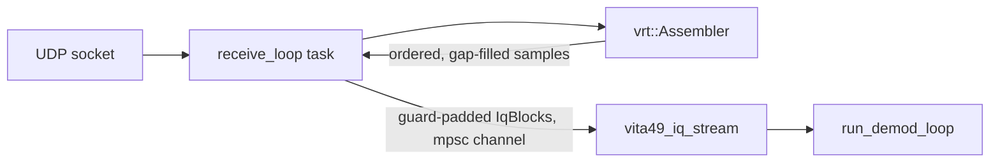

# VITA-49 (VRT) format notes, for implementing an IQ source/sink

## Purpose

Background for writing two new pieces:

1. A standalone app that reads raw IQ from an RTL-SDR and streams it out as
   VRT (VITA Radio Transport / VITA-49) packets over UDP -- a test source,
   playing the role a real VITA-49-capable SDR front-end would.
2. A `vita49_stream.h`/`.cpp` source for `adsb`, alongside
   `rtlsdr_stream.h`/`file_stream.h`, that reads that UDP stream and hands
   `IqBlock`s to `run_demod_loop` the same way the other two sources do.

This is **not** a full transcription of ANSI/VITA-49.0-2015 (that document is
paywalled and wasn't available to check directly). Everything below was
cross-checked against multiple independent, freely available sources: a real
open-source VRT parser ([eblossom/vita-49][eblossom], whose C bit-mask
constants are ground truth for the header and CIF0 layout), a vendor's public
VITA-49 device API docs ([Signal Hound PCR4200][signalhound], which documents
actual wire-format numbers for a real device), and an SDR interop wiki
([ICE][ice-wiki]). Where sources agreed, confidence is high; where only one
source had a number (mainly the trailer's indicator-bit *meanings*, and the
exact gain/reference-level Q-format), that's called out explicitly in
"Open items" at the end -- don't hard-code those without a second check.

**Scope decision**: since we're writing both ends of this link ourselves,
we don't need full ANSI/VITA-49 compliance -- just enough of the format to
be structurally valid and (ideally) readable by other VITA-49 tools if that
ever matters. That means: no Class ID (it exists for cross-vendor
disambiguation, which a private point-to-point stream doesn't need), and
only the context fields the decoder actually uses (sample rate, RF
reference frequency, gain, bandwidth).

## Packet model

Every VRT packet is a sequence of 32-bit words, big-endian (network byte
order) on the wire, structured like this:


Which optional sections are present, and how to interpret the payload, is
all determined by the header word -- there's no separate framing/length
prefix beyond what's in the header itself (`PacketSize`, see below). Each
VRT packet maps to exactly one UDP datagram in the common case (see
"UDP framing" below).

## Header word (word 0, always present)

Confirmed against eblossom/vita-49's `bits.h` mask constants:

| Bits  | Field         | Meaning |
|-------|---------------|---------|
| 31:28 | Packet Type   | `0x0`=IF Data (no Stream ID), `0x1`=IF Data (with Stream ID), `0x2`=Ext Data (no SID), `0x3`=Ext Data (with SID), `0x4`=IF Context, `0x5`=Ext Context |
| 27    | C             | Class ID present |
| 26    | T             | Trailer present (Data packets only) |
| 25    | SOB / (unused in Context) | Start-of-burst (Data packets) |
| 24    | EOB / TSM     | End-of-burst (Data packets) / Timestamp Mode (Context packets: 0=fine, 1=coarse) |
| 23:22 | TSI           | Integer-seconds timestamp mode: `00`=none, `01`=UTC, `10`=GPS, `11`=other |
| 21:20 | TSF           | Fractional-seconds timestamp mode: `00`=none, `01`=sample count, `10`=real-time (picoseconds), `11`=free-running count |
| 19:16 | Packet Count  | Modulo-16 sequence counter, per Stream ID |
| 15:0  | Packet Size   | Total packet length **in 32-bit words**, including the header word itself |

For our own stream we'll always use Packet Type `0x1` (IF Data, with Stream
ID) for IQ and `0x4` (IF Context) for metadata, `C=0` (no Class ID, see
Scope decision above), TSI=`01` (UTC) and TSF=`10` (picoseconds) so
timestamps are meaningful without needing a shared sample-count baseline.

## Stream ID (word 1, present whenever Packet Type has "with Stream ID", and always for Context packets)

32-bit opaque identifier grouping packets into one logical stream (e.g. one
per RF channel). For a single-RTL-SDR source, a fixed constant is fine --
there's only one stream.

## Timestamp (present per TSI/TSF, 1-3 words immediately after Stream ID/Class ID)

- **Integer seconds** (TSI≠`00`): 1 word, unsigned seconds since the TSI
  epoch (UTC epoch = Unix epoch, per Signal Hound's docs, which use
  `01`/UTC this exact way).
- **Fractional seconds** (TSF≠`00`): 2 words (64-bit), interpretation
  depends on TSF: sample count (`01`), real-time picoseconds since the
  last integer-second tick (`10`, range `0` to `999_999_999_999`), or a
  free-running counter (`11`). We'll use TSF=`10` (picoseconds) since it's
  self-contained -- no shared sample-count baseline needed between the
  sender and receiver.

## IF Data packet (Packet Type `0x1`)

Word layout: `Header | Stream ID | Timestamp (0-3 words) | IQ payload | Trailer (0 or 1 word)`.

Payload is interleaved 16-bit signed I/Q pairs, two's complement, **big-endian
on the wire** (same as everything else in VRT) -- this needs an explicit
byte-swap on both ends, since RTL-SDR's native samples are 8-bit
unsigned and the existing pipeline's `IqBlock` is presumably host-endian
`float`/`int16_t` already (check `iq_block.h` for the in-memory
representation the demod side expects before picking the wire sample type;
16-bit signed int matches rtlsdr's usable dynamic range without wasting
bandwidth the way a 32-bit float payload would).

### Trailer word (present iff header bit T=1)

Structurally: enable bits (upper half) paired with indicator/state bits
(lower half) for things like "calibrated time", "valid data", "reference
lock", "AGC/MGC", "detected signal", "over-range", plus a low 7-bit
"Associated Context Packet Count" field (with its own enable bit at bit 7).
Signal Hound's real device docs confirm this general enable/indicator
shape, but the *specific* bit-to-meaning table is packet-class-defined in
the full spec and wasn't independently confirmed here. **Recommendation:
skip the trailer entirely for our own stream** (`T=0` in the header) --
it's optional, we don't need over-range/lock indicators for a test
harness, and it sidesteps needing the exact bit table.

## IF Context packet (Packet Type `0x4`)

Word layout: `Header | Stream ID | Timestamp (0-3 words) | CIF0 word | <context fields present, per CIF0 bits, in fixed descending-bit order>`.

The CIF0 word is a 32-bit bitmask, one bit per optional context field; when
a bit is set, that field's word(s) appear in the payload in the same
(descending) order as the CIF0 bits, immediately after the CIF0 word
itself. Confirmed against eblossom/vita-49's `bits.h`:

| Bit | Field | Word(s) |
|-----|-------|---------|
| 31  | Context Field Change Indicator | 0 (marker only) |
| 30  | Reference Point ID | 1 |
| 29  | Bandwidth | 2 (64-bit) |
| 28  | IF Reference Frequency | 2 (64-bit) |
| 27  | RF Reference Frequency | 2 (64-bit) |
| 26  | RF Reference Frequency Offset | 2 (64-bit) |
| 25  | IF Band Offset | 2 (64-bit) |
| 24  | Reference Level | 1 |
| 23  | Gain | 1 |
| 22  | Over-range Count | 1 |
| 21  | Sample Rate | 2 (64-bit) |
| 20  | Timestamp Adjustment | 2 |
| 19  | Timestamp Calibration Time | 1 |
| 18  | Temperature | 1 |
| 17  | Device Identifier | 2 |
| 16  | State/Event Indicators | 1 |
| 15  | Data Payload Format | 2 |
| 14-8 | (GPS/INS/ephemeris/assoc-lists -- not needed here) | varies |

Fields we actually need for the demod side: **Bandwidth**, **RF Reference
Frequency**, **Sample Rate** (all three: Q44.20 fixed-point, signed,
64-bit, units Hz -- confirmed independently by both Signal Hound's and
the ICE-style vendor docs), and **Gain** (Signal Hound documents this as
two Q9.7 dB values packed into one 32-bit word -- see "Open items", this
one wasn't double-confirmed against a second independent source).

### Q44.20 worked example (frequency fields)

Q44.20 means a 64-bit signed two's-complement integer whose value equals
`Hz * 2^20`. To encode 1090 MHz (1_090_000_000.0 Hz):

```
raw = round(1_090_000_000.0 * (1 << 20))  // = 1_143_072_768_000_000 (fits in 64 bits easily)
```

To decode: `hz = double(raw) / double(1 << 20)`.

## UDP framing

VRT packets are normally sent one-per-datagram. `PacketSize` (header bits
15:0) is in 32-bit words and must match the actual packet length -- use it
as the receive-side sanity check (`datagram_len_bytes == PacketSize * 4`),
and drop anything that doesn't match rather than trying to reassemble
across datagrams. This also caps a single Data packet's IQ payload well
under the typical UDP-over-Ethernet safe size (~1472 bytes before IP
fragmentation) -- e.g. at 16-bit I + 16-bit Q per sample plus ~20 bytes of
header/stream-ID/timestamp, that's roughly 360 IQ samples per packet if we
want to stay under one MTU. RTL-SDR blocks will need chunking into several
Data packets rather than one packet per block.

## Recommended implementation order

1. **IF Data packet only**, minimal header (Stream ID + UTC/picosecond
   timestamp, `C=0`, `T=0`), fixed Stream ID, chunked to fit one UDP
   datagram. Get raw IQ flowing end-to-end through a `vita49_stream.h`
   source shaped like `rtlsdr_stream.h`/`file_stream.h` (same
   `coro::Stream<IqBlock>` interface `run_demod_loop` already consumes) --
   config (sample rate, frequency, gain) passed out-of-band via CLI flags
   on both sides to start, same as `--rate`/`--freq` today.
2. **IF Context packet**, sent once at stream start and on any config
   change, carrying just Sample Rate + RF Reference Frequency + Gain +
   Bandwidth -- lets the receiver pick up config from the stream itself
   instead of needing matching CLI flags on both ends.

   `vita49_send` implements this (both the `rtlsdr` and `sim` subcommands)
   with these choices:
   - Carries Bandwidth (CIF0 bit 29), RF Reference Frequency (27) and Sample
     Rate (21), in that order, each Q44.20; Gain is omitted until its
     Q-format is confirmed (see "Open items"). 12 words total: header, Stream
     ID, 3 timestamp words, CIF0, 3 x 2-word fields. Same header conventions
     as the data packets (C=0, TSI=UTC, TSF=picoseconds), with its own 4-bit
     packet counter.
   - Sent before the first data packet and then repeated every
     `--context-interval` seconds of signal (default 1.0, 0 = never), rather
     than only once: UDP can lose it and a receiver may join mid-stream. The
     interval is counted in samples, so it lands on the next packet boundary.
   - Timestamped with the time of the next data sample, i.e. equal to the
     timestamp of the data packet that follows it.
   - Context Field Change Indicator (CIF0 bit 31) is 1 on the first packet
     only; the config never changes mid-stream.
   - Bandwidth is advertised as equal to the sample rate; for the `sim` subcommand
     the RF frequency is just the `--freq` label (the IQ is baseband).

   Receivers should treat a data packet's own timestamps as authoritative for
   placement and use the context for the metadata; `tests/vrt_to_sigmf.py`
   reads the rate and frequency from it and refuses to record if the context,
   its `--sample-rate` flag and the data timestamps disagree.

## Receiver (`adsb vita49`)

`src/input/vita49_stream.cpp` (socket + task plumbing) and `src/input/vrt_assembler.cpp`
(pure packet-to-sample logic, unit-tested by `tests/vita49_stream_test.cpp`)
implement the source described in the introduction.



Subcommand options: `--port` (required), `--bind`, `--stream-id`,
`--idle-timeout`, e.g. `adsb --rate 2.4e6 vita49 --port 4991`. The sample
rate comes from the global `--rate` (default 2.4e6), since the resampling
filter and block padding are built for it before the stream starts.

Assembler rules:
- Packets are validated strictly (length, no class ID / trailer, TSI=UTC,
  TSF=ps, size field == datagram length); anything else is counted as invalid.
- Samples are placed by timestamp, not arrival order: a min-heap with a
  256-packet reorder window fixes UDP reordering (seen on WSL2 loopback).
  Sample index = floor(delta_ps * rate / 1e12 + 0.5), in `__int128`.
- Gaps are zero-filled. A jump over 1 s in either direction is treated as a
  sender restart: rebase, no fill. Late and duplicate packets are dropped.
- Sample rate: `adsb` always gives the assembler `--rate`. A context packet
  that disagrees by more than 0.1% is a fatal error. (Used on its own, without
  a rate, the assembler discards data packets until a context packet supplies
  one.) The stream id latches to the first one seen unless filtered.
- The receive task never blocks on the demod: if the channel is full, blocks are
  dropped with a warning (same policy as `rtlsdr_stream`).
- The stream ends on Ctrl+C or after `--idle-timeout` s of silence.

Blocks carry their stream sample index, so the `BlockStitcher` in
`run_demod_loop` joins consecutive blocks and frames that straddle a block
boundary still decode. Blocks dropped because the channel was full leave a gap,
and the stitcher does not join blocks across it.

## Open items (verify before treating as final)

- Trailer word's exact indicator-bit meanings (not needed if `T=0`, per
  the recommendation above).
- Gain/Reference Level Q-format: Signal Hound's docs say Q9.7 dB/dBm;
  general VITA-49 material elsewhere sometimes cites Q7.9 for the same
  fields -- worth confirming against whatever we actually decide to send,
  since we control both ends and can just pick one and be internally
  consistent, but flag it if interop with a third-party VITA-49 tool ever
  matters.
- `iq_block.h`'s actual in-memory sample representation (float vs int16_t)
  wasn't checked while writing this -- confirm before deciding the wire
  payload's sample width/scaling on the encode and decode sides.

## Sources

- [eblossom/vita-49 `bits.h`][eblossom] -- real C bit-mask constants for
  header and CIF0 layout; the most authoritative source used here.
- [Signal Hound PCR4200 VITA-49 API docs][signalhound] -- real device's
  documented wire format, including confirmed Q44.20/Q9.7 formats.
- [ICE VITA 49.0 Radio Transport Ethernet Packet Specification wiki][ice-wiki]
  -- corroborated Stream ID / Class ID word layout.

[eblossom]: https://github.com/eblossom/vita-49/blob/master/vrt/include/vrt/bits.h
[signalhound]: https://signalhound.com/sigdownloads/SDK/online_docs/pcr_api/iq_v_r_t.html
[ice-wiki]: https://wiki.ice-online.com/ICE_VITA_49.0_Radio_Transport_Ethernet_Packet_Specification
